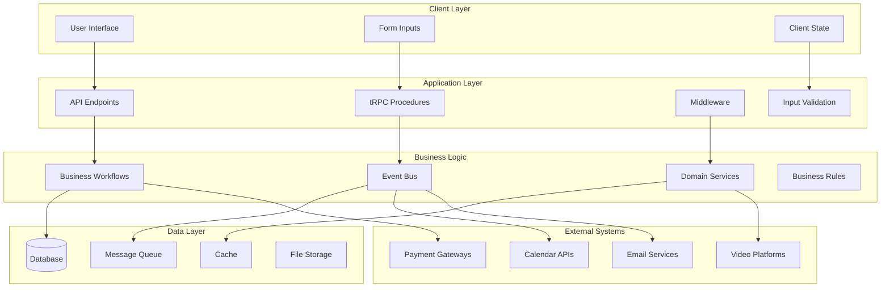
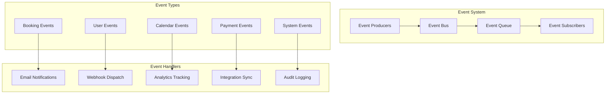
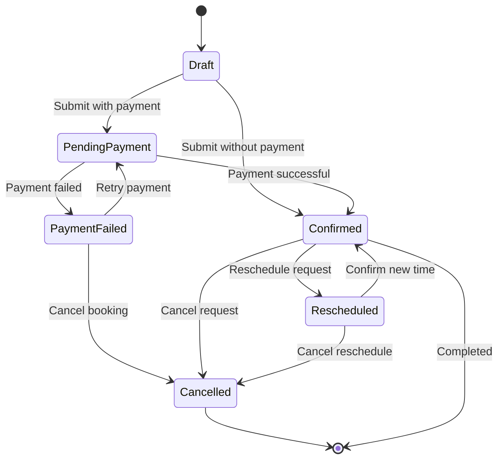
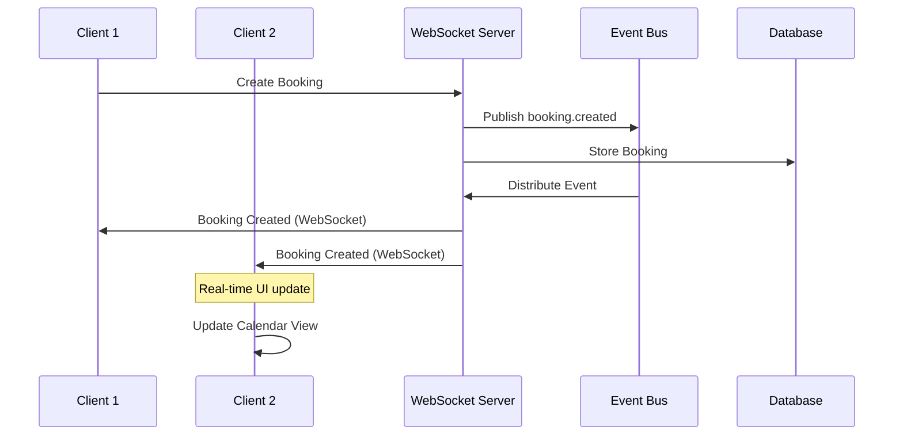
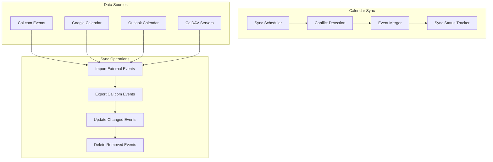

# Data Flow & Event System

Cal.com implements a sophisticated data flow architecture with event-driven patterns, booking workflows, and real-time synchronization. This system ensures data consistency across multiple integrations while providing excellent user experience through optimistic updates and real-time collaboration.

## Data Flow Overview



## Event-Driven Architecture

### Event Bus Implementation



### Event System Implementation

```typescript
// Event definitions
export interface DomainEvent {
  id: string;
  type: string;
  aggregateId: string;
  aggregateType: string;
  version: number;
  payload: any;
  metadata: {
    userId?: number;
    organizationId?: number;
    timestamp: Date;
    correlationId?: string;
    causationId?: string;
  };
}

// Event types
export enum EventType {
  // Booking events
  BOOKING_CREATED = 'booking.created',
  BOOKING_UPDATED = 'booking.updated',
  BOOKING_CANCELLED = 'booking.cancelled',
  BOOKING_CONFIRMED = 'booking.confirmed',
  BOOKING_RESCHEDULED = 'booking.rescheduled',

  // User events
  USER_CREATED = 'user.created',
  USER_UPDATED = 'user.updated',
  USER_DELETED = 'user.deleted',

  // Calendar events
  CALENDAR_CONNECTED = 'calendar.connected',
  CALENDAR_DISCONNECTED = 'calendar.disconnected',
  CALENDAR_EVENT_CREATED = 'calendar.event.created',
  CALENDAR_EVENT_UPDATED = 'calendar.event.updated',

  // Payment events
  PAYMENT_INITIATED = 'payment.initiated',
  PAYMENT_COMPLETED = 'payment.completed',
  PAYMENT_FAILED = 'payment.failed',
  PAYMENT_REFUNDED = 'payment.refunded',
}

// Event bus implementation
export class EventBus {
  private static subscribers = new Map<string, EventHandler[]>();
  private static queue: DomainEvent[] = [];
  private static processing = false;

  static subscribe(eventType: string, handler: EventHandler) {
    if (!this.subscribers.has(eventType)) {
      this.subscribers.set(eventType, []);
    }
    this.subscribers.get(eventType)!.push(handler);
  }

  static async publish(event: DomainEvent) {
    // Add to queue
    this.queue.push(event);

    // Store event in database for reliability
    await this.persistEvent(event);

    // Process queue
    if (!this.processing) {
      await this.processQueue();
    }
  }

  private static async processQueue() {
    this.processing = true;

    while (this.queue.length > 0) {
      const event = this.queue.shift()!;
      await this.processEvent(event);
    }

    this.processing = false;
  }

  private static async processEvent(event: DomainEvent) {
    const handlers = this.subscribers.get(event.type) || [];

    // Process handlers in parallel
    const promises = handlers.map(async (handler) => {
      try {
        await handler.handle(event);
      } catch (error) {
        logger.error('Event handler failed', {
          eventId: event.id,
          eventType: event.type,
          handlerName: handler.constructor.name,
          error,
        });

        // Add to dead letter queue for retry
        await this.addToDeadLetterQueue(event, handler, error);
      }
    });

    await Promise.allSettled(promises);
  }

  private static async persistEvent(event: DomainEvent) {
    await prisma.domainEvent.create({
      data: {
        id: event.id,
        type: event.type,
        aggregateId: event.aggregateId,
        aggregateType: event.aggregateType,
        version: event.version,
        payload: event.payload,
        metadata: event.metadata,
        createdAt: new Date(),
      },
    });
  }
}
```

## Booking Workflow Engine

### Booking State Machine



### Booking Workflow Implementation

```typescript
// Booking workflow orchestrator
export class BookingWorkflow {
  constructor(
    private bookingId: number,
    private eventBus: EventBus
  ) {}

  async createBooking(data: CreateBookingData): Promise<Booking> {
    const workflow = new WorkflowBuilder()
      .step('validate', async () => {
        return await this.validateBookingRequest(data);
      })
      .step('checkAvailability', async (validatedData) => {
        return await this.checkAvailability(validatedData);
      })
      .step('createCalendarEvents', async (availabilityData) => {
        return await this.createCalendarEvents(availabilityData);
      })
      .step('processPayment', async (calendarData) => {
        if (data.payment) {
          return await this.processPayment(calendarData, data.payment);
        }
        return calendarData;
      })
      .step('sendNotifications', async (paymentData) => {
        return await this.sendNotifications(paymentData);
      })
      .step('createBookingRecord', async (notificationData) => {
        return await this.createBookingRecord(notificationData);
      })
      .onError(async (error, step, data) => {
        await this.handleWorkflowError(error, step, data);
      })
      .build();

    try {
      const result = await workflow.execute(data);

      // Publish success event
      await this.eventBus.publish({
        id: uuidv4(),
        type: EventType.BOOKING_CREATED,
        aggregateId: result.booking.id.toString(),
        aggregateType: 'booking',
        version: 1,
        payload: result.booking,
        metadata: {
          userId: data.userId,
          organizationId: data.organizationId,
          timestamp: new Date(),
        },
      });

      return result.booking;
    } catch (error) {
      // Publish error event
      await this.eventBus.publish({
        id: uuidv4(),
        type: 'booking.creation.failed',
        aggregateId: data.eventTypeId.toString(),
        aggregateType: 'booking',
        version: 1,
        payload: { error: error.message, data },
        metadata: {
          userId: data.userId,
          timestamp: new Date(),
        },
      });

      throw error;
    }
  }

  private async validateBookingRequest(data: CreateBookingData): Promise<ValidatedBookingData> {
    // Validate event type exists and is bookable
    const eventType = await prisma.eventType.findUnique({
      where: { id: data.eventTypeId },
      include: {
        owner: true,
        team: true,
        workflows: true,
      },
    });

    if (!eventType) {
      throw new BookingError('Event type not found');
    }

    if (!eventType.active) {
      throw new BookingError('Event type is not active');
    }

    // Validate time slot
    const startTime = new Date(data.startTime);
    const endTime = new Date(data.endTime);
    const now = new Date();

    if (startTime < now) {
      throw new BookingError('Cannot book in the past');
    }

    if (endTime <= startTime) {
      throw new BookingError('End time must be after start time');
    }

    // Validate duration
    const duration = (endTime.getTime() - startTime.getTime()) / (1000 * 60);
    if (duration !== eventType.length) {
      throw new BookingError('Invalid booking duration');
    }

    return {
      ...data,
      eventType,
      startTime,
      endTime,
      duration,
    };
  }

  private async checkAvailability(data: ValidatedBookingData): Promise<AvailabilityData> {
    // Check user availability
    const availability = await this.availabilityService.getUserAvailability(
      data.eventType.ownerId,
      data.startTime,
      data.endTime
    );

    if (!availability.isAvailable) {
      throw new BookingError('Time slot is not available', {
        reason: availability.reason,
        conflictingBookings: availability.conflicts,
      });
    }

    // Check team member availability if team event
    if (data.eventType.teamId) {
      const teamAvailability = await this.availabilityService.getTeamAvailability(
        data.eventType.teamId,
        data.startTime,
        data.endTime
      );

      if (!teamAvailability.isAvailable) {
        throw new BookingError('Team members are not available');
      }
    }

    return {
      ...data,
      availability,
      assignedTeamMembers: data.eventType.teamId ? teamAvailability.availableMembers : [],
    };
  }

  private async createCalendarEvents(data: AvailabilityData): Promise<CalendarEventData> {
    const calendarEvents: CalendarEvent[] = [];

    // Create calendar event for organizer
    const organizerEvent = await this.calendarService.createEvent({
      title: `${data.eventType.title} with ${data.attendee.name}`,
      description: data.eventType.description,
      startTime: data.startTime,
      endTime: data.endTime,
      attendees: [
        { email: data.attendee.email, name: data.attendee.name },
        { email: data.eventType.owner.email, name: data.eventType.owner.name },
      ],
      location: data.location,
      organizer: data.eventType.owner,
    });

    calendarEvents.push(organizerEvent);

    // Create calendar events for team members
    for (const member of data.assignedTeamMembers) {
      const memberEvent = await this.calendarService.createEvent({
        title: `${data.eventType.title} with ${data.attendee.name}`,
        description: data.eventType.description,
        startTime: data.startTime,
        endTime: data.endTime,
        attendees: [
          { email: data.attendee.email, name: data.attendee.name },
          { email: member.email, name: member.name },
        ],
        location: data.location,
        organizer: member,
      });

      calendarEvents.push(memberEvent);
    }

    return {
      ...data,
      calendarEvents,
    };
  }
}
```

## Real-time Data Synchronization

### WebSocket Event Distribution



### Real-time Event Distribution

```typescript
// WebSocket event distributor
export class RealtimeEventDistributor {
  private static connections = new Map<string, WebSocket[]>();

  static addConnection(userId: string, ws: WebSocket) {
    if (!this.connections.has(userId)) {
      this.connections.set(userId, []);
    }
    this.connections.get(userId)!.push(ws);

    ws.on('close', () => {
      this.removeConnection(userId, ws);
    });
  }

  static removeConnection(userId: string, ws: WebSocket) {
    const userConnections = this.connections.get(userId);
    if (userConnections) {
      const index = userConnections.indexOf(ws);
      if (index > -1) {
        userConnections.splice(index, 1);
      }

      if (userConnections.length === 0) {
        this.connections.delete(userId);
      }
    }
  }

  static async distributeEvent(event: DomainEvent) {
    // Determine affected users
    const affectedUsers = await this.getAffectedUsers(event);

    // Send to connected clients
    for (const userId of affectedUsers) {
      const connections = this.connections.get(userId.toString()) || [];

      for (const ws of connections) {
        if (ws.readyState === WebSocket.OPEN) {
          ws.send(JSON.stringify({
            type: 'event',
            data: event,
          }));
        }
      }
    }
  }

  private static async getAffectedUsers(event: DomainEvent): Promise<number[]> {
    switch (event.type) {
      case EventType.BOOKING_CREATED:
      case EventType.BOOKING_UPDATED:
      case EventType.BOOKING_CANCELLED:
        return await this.getBookingAffectedUsers(event.aggregateId);

      case EventType.CALENDAR_EVENT_CREATED:
        return await this.getCalendarEventAffectedUsers(event.payload);

      default:
        return [];
    }
  }

  private static async getBookingAffectedUsers(bookingId: string): Promise<number[]> {
    const booking = await prisma.booking.findUnique({
      where: { id: parseInt(bookingId) },
      include: {
        user: true,
        eventType: {
          include: {
            owner: true,
            team: {
              include: { members: true },
            },
          },
        },
        attendees: true,
      },
    });

    if (!booking) return [];

    const affectedUsers = [booking.userId, booking.eventType.ownerId];

    // Add team members
    if (booking.eventType.team) {
      affectedUsers.push(...booking.eventType.team.members.map(m => m.userId));
    }

    return [...new Set(affectedUsers)];
  }
}

// Register event distributor as event handler
EventBus.subscribe('*', {
  handle: async (event: DomainEvent) => {
    await RealtimeEventDistributor.distributeEvent(event);
  },
});
```

## Data Consistency Patterns

### Optimistic Updates with Rollback

```typescript
// Optimistic update pattern for booking operations
export function useOptimisticBookingUpdate() {
  const utils = trpc.useContext();

  const updateBooking = trpc.viewer.bookings.update.useMutation({
    onMutate: async (variables) => {
      // Cancel outgoing refetches
      await utils.viewer.bookings.list.cancel();

      // Snapshot previous value
      const previousBookings = utils.viewer.bookings.list.getData();

      // Optimistically update
      utils.viewer.bookings.list.setData(undefined, (old) => {
        if (!old) return old;

        return old.map(booking =>
          booking.id === variables.id
            ? { ...booking, ...variables.data }
            : booking
        );
      });

      return { previousBookings };
    },

    onError: (err, variables, context) => {
      // Rollback on error
      if (context?.previousBookings) {
        utils.viewer.bookings.list.setData(undefined, context.previousBookings);
      }
    },

    onSettled: () => {
      // Always refetch to ensure consistency
      utils.viewer.bookings.list.invalidate();
    },
  });

  return updateBooking;
}
```

### Event Sourcing for Critical Operations

```typescript
// Event sourcing for booking state changes
export class BookingAggregate {
  private events: DomainEvent[] = [];
  private version = 0;

  constructor(
    private id: number,
    private state: BookingState
  ) {}

  static async fromHistory(bookingId: number): Promise<BookingAggregate> {
    const events = await prisma.domainEvent.findMany({
      where: {
        aggregateId: bookingId.toString(),
        aggregateType: 'booking',
      },
      orderBy: { version: 'asc' },
    });

    const initialState = this.getInitialState();
    let currentState = initialState;

    for (const event of events) {
      currentState = this.applyEvent(currentState, event);
    }

    const aggregate = new BookingAggregate(bookingId, currentState);
    aggregate.version = events.length;

    return aggregate;
  }

  rescheduleBooking(newStartTime: Date, newEndTime: Date) {
    if (this.state.status !== BookingStatus.CONFIRMED) {
      throw new Error('Can only reschedule confirmed bookings');
    }

    const event = this.createEvent(EventType.BOOKING_RESCHEDULED, {
      oldStartTime: this.state.startTime,
      oldEndTime: this.state.endTime,
      newStartTime,
      newEndTime,
    });

    this.apply(event);
  }

  cancelBooking(reason?: string) {
    if (this.state.status === BookingStatus.CANCELLED) {
      throw new Error('Booking is already cancelled');
    }

    const event = this.createEvent(EventType.BOOKING_CANCELLED, {
      reason,
      cancelledAt: new Date(),
    });

    this.apply(event);
  }

  private apply(event: DomainEvent) {
    this.state = BookingAggregate.applyEvent(this.state, event);
    this.events.push(event);
    this.version++;
  }

  private createEvent(type: EventType, payload: any): DomainEvent {
    return {
      id: uuidv4(),
      type,
      aggregateId: this.id.toString(),
      aggregateType: 'booking',
      version: this.version + 1,
      payload,
      metadata: {
        timestamp: new Date(),
      },
    };
  }

  async save() {
    // Save new events
    for (const event of this.events) {
      await prisma.domainEvent.create({
        data: {
          ...event,
          createdAt: new Date(),
        },
      });

      // Publish event
      await EventBus.publish(event);
    }

    // Update projection/read model
    await this.updateBookingProjection();

    this.events = [];
  }

  private async updateBookingProjection() {
    await prisma.booking.update({
      where: { id: this.id },
      data: {
        status: this.state.status,
        startTime: this.state.startTime,
        endTime: this.state.endTime,
        // ... other fields
      },
    });
  }
}
```

## Integration Data Synchronization

### Calendar Sync Engine



### Sync Implementation

```typescript
// Calendar synchronization service
export class CalendarSyncService {
  async syncUserCalendars(userId: number): Promise<SyncResult> {
    const user = await prisma.user.findUnique({
      where: { id: userId },
      include: {
        credentials: true,
        selectedCalendars: true,
      },
    });

    if (!user) throw new Error('User not found');

    const syncResults: SyncResult[] = [];

    for (const credential of user.credentials) {
      try {
        const result = await this.syncCredential(credential, user.selectedCalendars);
        syncResults.push(result);
      } catch (error) {
        logger.error('Calendar sync failed', {
          userId,
          credentialId: credential.id,
          error,
        });

        syncResults.push({
          credentialId: credential.id,
          success: false,
          error: error.message,
        });
      }
    }

    return this.aggregateSyncResults(syncResults);
  }

  private async syncCredential(
    credential: Credential,
    selectedCalendars: SelectedCalendar[]
  ): Promise<SyncResult> {
    const calendarService = this.getCalendarService(credential);
    const relevantCalendars = selectedCalendars.filter(
      sc => sc.integration === credential.type
    );

    let importedEvents = 0;
    let exportedEvents = 0;
    let conflicts: ConflictEvent[] = [];

    for (const selectedCalendar of relevantCalendars) {
      // Import external events
      const externalEvents = await calendarService.getEvents(
        selectedCalendar.externalId,
        this.getSyncStartDate(),
        this.getSyncEndDate()
      );

      for (const externalEvent of externalEvents) {
        const result = await this.processExternalEvent(externalEvent, credential.userId);

        if (result.imported) {
          importedEvents++;
        }

        if (result.conflict) {
          conflicts.push(result.conflict);
        }
      }

      // Export Cal.com events
      const calcomEvents = await this.getCalcomEventsForSync(
        credential.userId,
        selectedCalendar.externalId
      );

      for (const calcomEvent of calcomEvents) {
        await this.exportCalcomEvent(calcomEvent, calendarService, selectedCalendar);
        exportedEvents++;
      }
    }

    return {
      credentialId: credential.id,
      success: true,
      importedEvents,
      exportedEvents,
      conflicts,
      lastSyncAt: new Date(),
    };
  }

  private async processExternalEvent(
    externalEvent: ExternalCalendarEvent,
    userId: number
  ): Promise<ProcessEventResult> {
    // Check if event already exists
    const existingEvent = await prisma.externalCalendarEvent.findFirst({
      where: {
        externalId: externalEvent.id,
        userId,
      },
    });

    if (existingEvent) {
      return await this.updateExternalEvent(existingEvent, externalEvent);
    } else {
      return await this.createExternalEvent(externalEvent, userId);
    }
  }

  private async detectConflicts(
    externalEvent: ExternalCalendarEvent,
    userId: number
  ): Promise<ConflictEvent[]> {
    const conflicts: ConflictEvent[] = [];

    // Find overlapping Cal.com bookings
    const overlappingBookings = await prisma.booking.findMany({
      where: {
        userId,
        status: { in: [BookingStatus.CONFIRMED, BookingStatus.ACCEPTED] },
        OR: [
          {
            AND: [
              { startTime: { lte: externalEvent.startTime } },
              { endTime: { gt: externalEvent.startTime } },
            ],
          },
          {
            AND: [
              { startTime: { lt: externalEvent.endTime } },
              { endTime: { gte: externalEvent.endTime } },
            ],
          },
        ],
      },
      include: { eventType: true },
    });

    for (const booking of overlappingBookings) {
      conflicts.push({
        type: 'time_conflict',
        externalEvent,
        calcomBooking: booking,
        severity: this.calculateConflictSeverity(externalEvent, booking),
      });
    }

    return conflicts;
  }
}
```

This comprehensive data flow and event system architecture ensures Cal.com maintains data consistency, provides real-time updates, and handles complex business workflows while integrating seamlessly with external systems.
