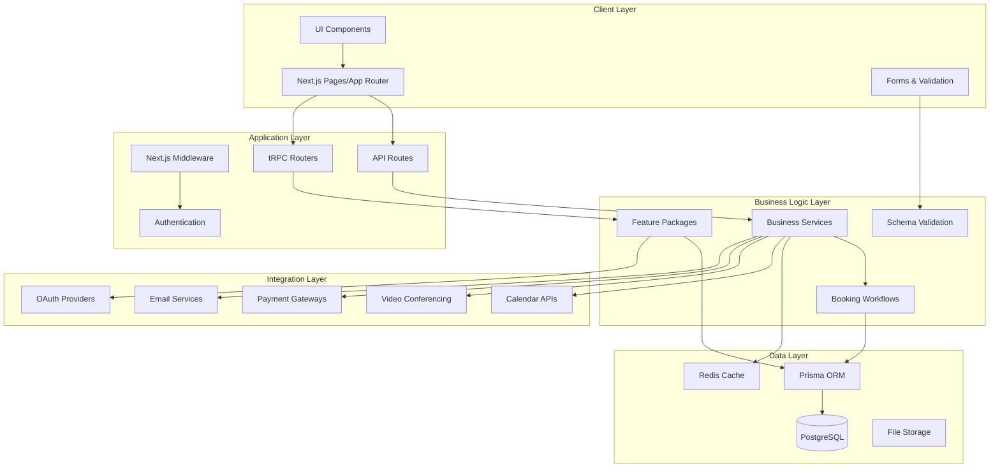
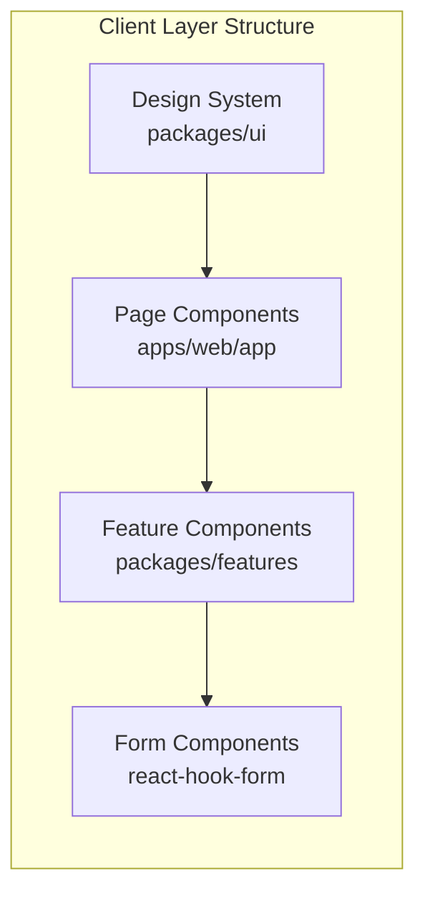
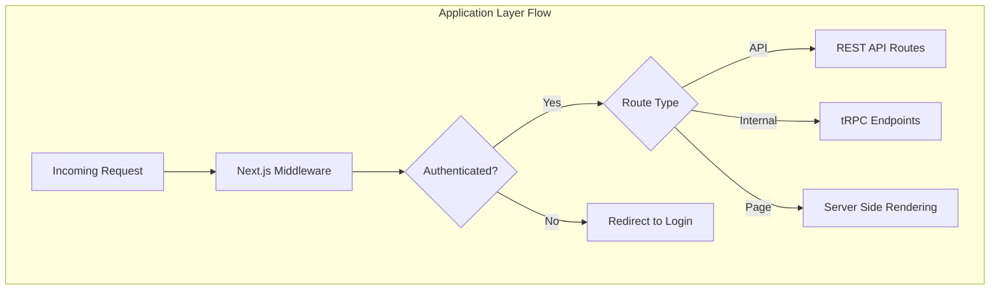
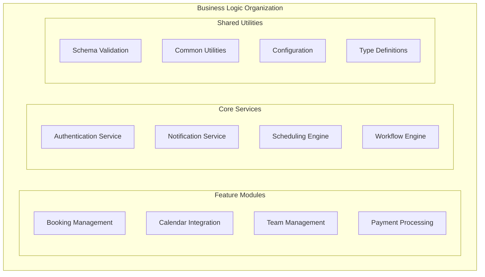
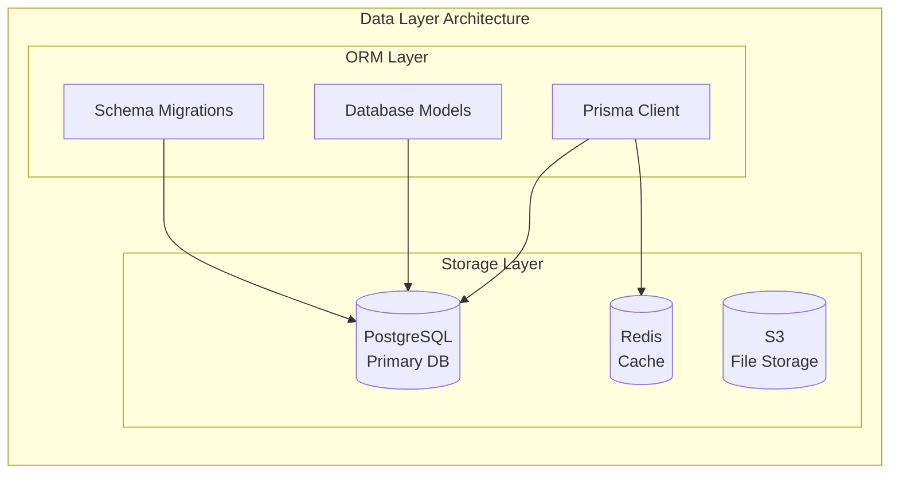
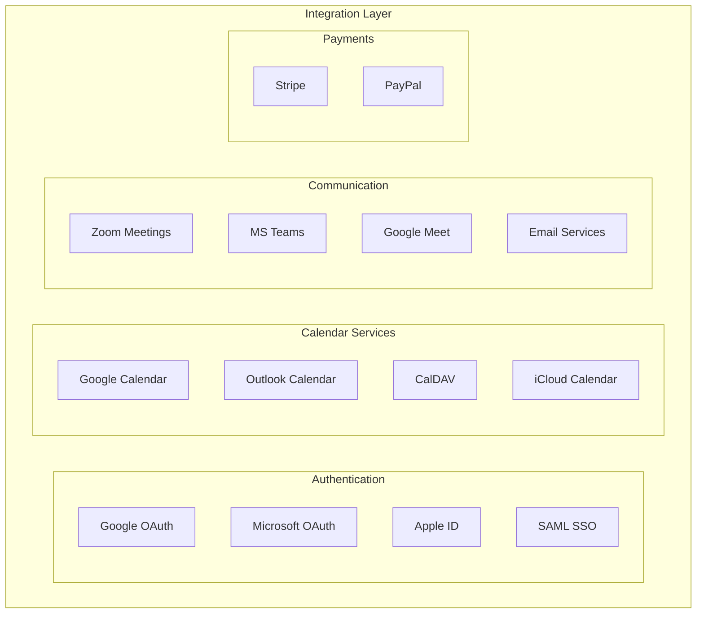

# Layered Architecture

Cal.com follows a modular layered architecture that promotes separation of concerns, maintainability, and scalability. The system is organized into distinct layers, each with specific responsibilities.

## High-Level Architecture Overview



## Layer Descriptions

### 1. Client Layer (Presentation)

**Location**: `apps/web/app/`, `apps/web/pages/`, `packages/ui/`

The presentation layer handles user interface and user experience concerns.

#### Components

- **UI Components** (`packages/ui/`): Reusable design system components
- **Pages & Layouts** (`apps/web/app/`, `apps/web/pages/`): Next.js routing and page components
- **Forms & Validation**: Client-side form handling with react-hook-form



#### Key Patterns

- **Component Composition**: Highly composable UI components
- **Server Components**: Next.js 14 App Router with RSC
- **Progressive Enhancement**: Works without JavaScript
- **Responsive Design**: Mobile-first approach

### 2. Application Layer (Orchestration)

**Location**: `apps/web/middleware.ts`, `apps/web/pages/api/`, `packages/trpc/`

The application layer orchestrates requests, handles routing, and manages cross-cutting concerns.

#### Structure

- **Middleware**: Authentication, routing, CORS, rate limiting
- **API Routes**: RESTful endpoints for external integrations
- **tRPC Routers**: Type-safe internal API layer
- **Authentication**: NextAuth.js integration



#### Key Features

- **Type Safety**: End-to-end TypeScript with tRPC
- **Authentication**: Multi-provider OAuth with NextAuth.js
- **Rate Limiting**: Request throttling and abuse prevention
- **CORS**: Cross-origin resource sharing configuration

### 3. Business Logic Layer (Domain)

**Location**: `packages/features/`, `packages/lib/`, `apps/web/lib/`

The business logic layer contains the core domain logic and feature implementations.

#### Structure

- **Feature Packages**: Self-contained feature modules
- **Business Services**: Core business logic implementation
- **Workflow Engines**: Booking and scheduling workflows
- **Schema Validation**: Zod schemas for data validation



#### Key Patterns

- **Domain-Driven Design**: Features organized by business domains
- **Service Layer**: Business logic abstracted into services
- **Event-Driven**: Pub/sub pattern for decoupled communication
- **Validation**: Runtime schema validation with Zod

### 4. Data Layer (Persistence)

**Location**: `packages/prisma/`, database configurations

The data layer manages data persistence, caching, and storage concerns.

#### Structure

- **Prisma ORM**: Type-safe database access
- **PostgreSQL**: Primary relational database
- **Redis Cache**: Session and application caching
- **File Storage**: Static assets and user uploads



#### Key Features

- **Type Safety**: Generated TypeScript types from schema
- **Migration Management**: Version-controlled schema changes
- **Connection Pooling**: Efficient database connection management
- **Query Optimization**: Optimized queries with proper indexing

### 5. Integration Layer (External Services)

**Location**: `packages/app-store/`, integration-specific packages

The integration layer handles external service communication and third-party APIs.

#### Structure

- **OAuth Providers**: Google, Microsoft, Apple, etc.
- **Calendar APIs**: Google Calendar, Outlook, CalDAV
- **Video Conferencing**: Zoom, Google Meet, MS Teams
- **Payment Gateways**: Stripe, PayPal
- **Email Services**: SendGrid, Postmark, SMTP



## Package Organization

### Core Packages

```
packages/
├── ui/                    # Design system components
├── lib/                   # Shared utilities and helpers
├── types/                 # TypeScript type definitions
├── config/                # Configuration management
├── prisma/                # Database schema and client
├── trpc/                  # API layer and routers
├── features/              # Business logic features
├── emails/                # Email templates and services
├── app-store/             # Third-party integrations
└── platform/              # Platform-specific components
```

### Feature Package Structure

```
packages/features/[feature]/
├── components/            # React components
├── lib/                   # Business logic
├── hooks/                 # React hooks
├── types/                 # Type definitions
├── api/                   # API endpoints
├── server/                # Server-side logic
└── index.ts              # Public exports
```

## Cross-Cutting Concerns

### Security

- **Authentication**: JWT tokens with NextAuth.js
- **Authorization**: Role-based access control (RBAC)
- **Data Validation**: Input sanitization and validation
- **CSRF Protection**: Cross-site request forgery prevention

### Performance

- **Code Splitting**: Dynamic imports and lazy loading
- **Caching**: Multiple caching layers (Redis, CDN, browser)
- **Database Optimization**: Query optimization and indexing
- **Image Optimization**: Next.js image optimization

### Observability

- **Logging**: Structured logging with Winston
- **Monitoring**: Application performance monitoring
- **Error Tracking**: Sentry integration
- **Analytics**: User behavior tracking

## Benefits of This Architecture

1. **Separation of Concerns**: Each layer has clear responsibilities
2. **Maintainability**: Changes isolated to specific layers
3. **Testability**: Easy to unit test individual layers
4. **Scalability**: Layers can be scaled independently
5. **Flexibility**: Easy to swap implementations within layers
6. **Type Safety**: End-to-end TypeScript integration

## Development Guidelines

### Adding New Features

1. Create feature package in `packages/features/`
2. Implement business logic in service layer
3. Add UI components in presentation layer
4. Create API endpoints in application layer
5. Add database models if needed
6. Write comprehensive tests

### Best Practices

- Keep layers decoupled
- Use dependency injection
- Implement proper error handling
- Follow TypeScript strict mode
- Write self-documenting code
- Maintain consistent naming conventions
