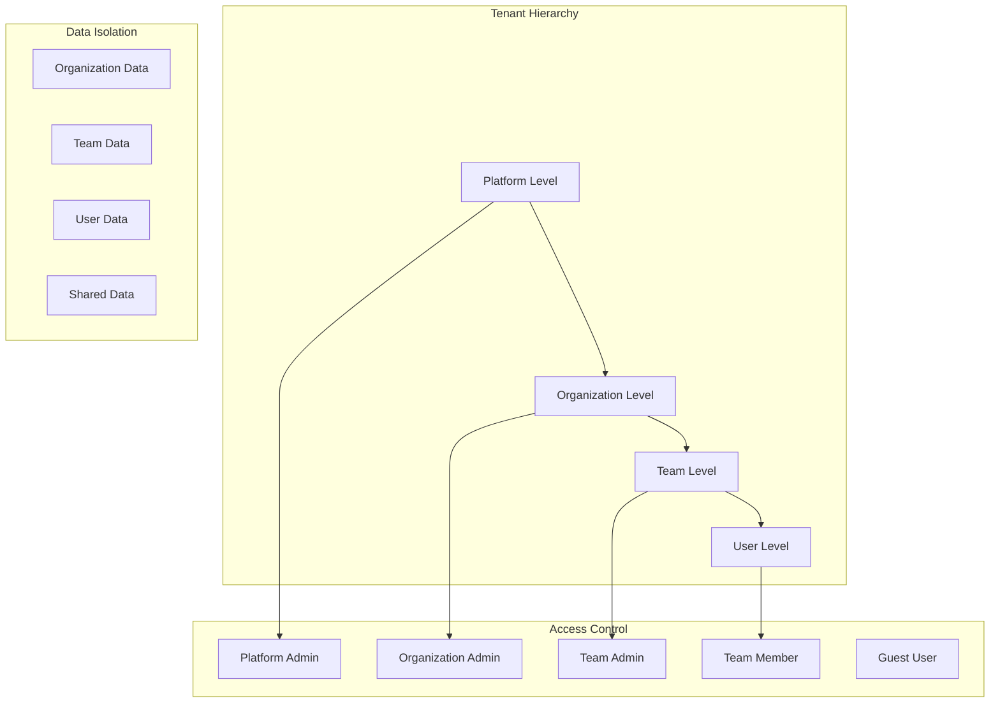
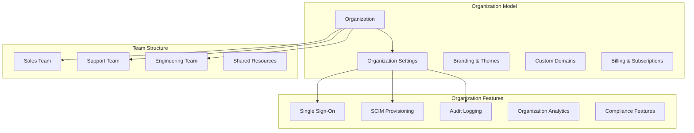
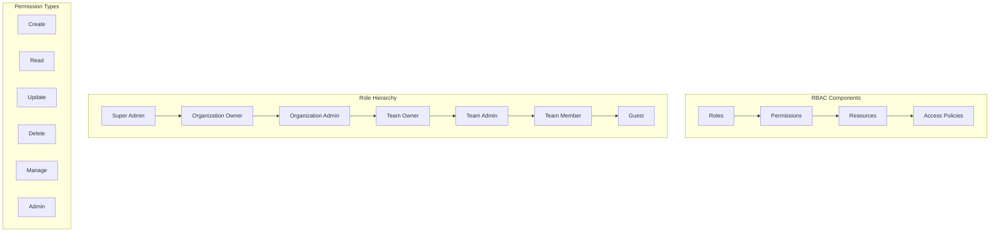
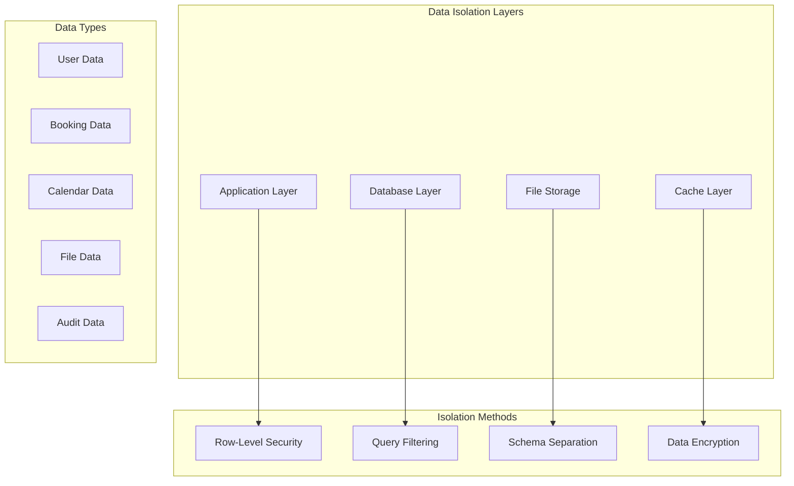
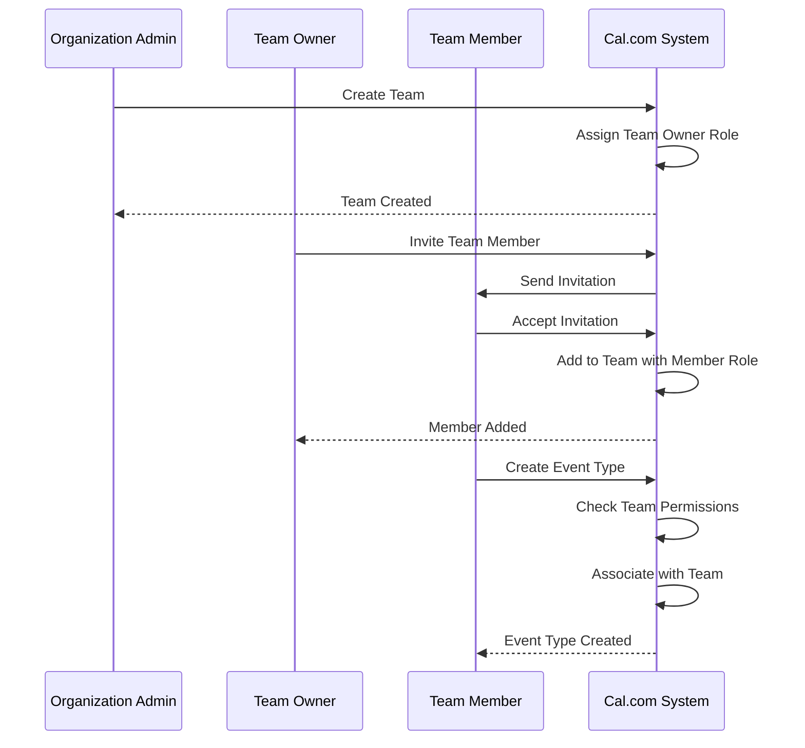

# Multi-Tenancy & RBAC

Cal.com implements a comprehensive multi-tenancy architecture with organizations, teams, and role-based access control (RBAC). This system enables enterprise-grade access management, data isolation, and hierarchical permissions.

## Multi-Tenancy Overview



## Organization Architecture

### Organization Structure



### Organization Data Model

```typescript
// Organization schema
model Organization {
  id          Int      @id @default(autoincrement())
  name        String
  slug        String   @unique
  metadata    Json?

  // Branding
  logo        String?
  theme       Json?
  customDomains String[]

  // Billing
  plan        Plan     @default(FREE)
  billingId   String?
  subscription Json?

  // Settings
  settings    Json     @default("{}")
  features    Json     @default("{}")

  // Relationships
  teams       Team[]
  users       User[]
  eventTypes  EventType[]
  bookings    Booking[]

  // Audit
  createdAt   DateTime @default(now())
  updatedAt   DateTime @updatedAt

  @@map("organizations")
}

model Team {
  id             Int          @id @default(autoincrement())
  name           String
  slug           String
  description    String?
  logo           String?

  // Organization relationship
  organizationId Int?
  organization   Organization? @relation(fields: [organizationId], references: [id], onDelete: Cascade)

  // Team settings
  settings       Json         @default("{}")
  metadata       Json?

  // Relationships
  members        TeamMember[]
  eventTypes     EventType[]
  bookings       Booking[]

  createdAt      DateTime     @default(now())
  updatedAt      DateTime     @updatedAt

  @@unique([organizationId, slug])
  @@map("teams")
}
```

## Role-Based Access Control (RBAC)

### Permission System



### Permission Implementation

```typescript
// Permission definitions
export enum Permission {
  // User permissions
  USER_CREATE = 'user:create',
  USER_READ = 'user:read',
  USER_UPDATE = 'user:update',
  USER_DELETE = 'user:delete',

  // Organization permissions
  ORG_CREATE = 'org:create',
  ORG_READ = 'org:read',
  ORG_UPDATE = 'org:update',
  ORG_DELETE = 'org:delete',
  ORG_MANAGE_MEMBERS = 'org:manage_members',
  ORG_MANAGE_TEAMS = 'org:manage_teams',
  ORG_MANAGE_BILLING = 'org:manage_billing',

  // Team permissions
  TEAM_CREATE = 'team:create',
  TEAM_READ = 'team:read',
  TEAM_UPDATE = 'team:update',
  TEAM_DELETE = 'team:delete',
  TEAM_MANAGE_MEMBERS = 'team:manage_members',

  // Booking permissions
  BOOKING_CREATE = 'booking:create',
  BOOKING_READ = 'booking:read',
  BOOKING_UPDATE = 'booking:update',
  BOOKING_DELETE = 'booking:delete',
  BOOKING_MANAGE = 'booking:manage',

  // Event type permissions
  EVENT_TYPE_CREATE = 'event_type:create',
  EVENT_TYPE_READ = 'event_type:read',
  EVENT_TYPE_UPDATE = 'event_type:update',
  EVENT_TYPE_DELETE = 'event_type:delete',
}

// Role definitions
export const ROLES = {
  SUPER_ADMIN: {
    name: 'Super Admin',
    permissions: Object.values(Permission),
  },

  ORG_OWNER: {
    name: 'Organization Owner',
    permissions: [
      Permission.ORG_READ,
      Permission.ORG_UPDATE,
      Permission.ORG_MANAGE_MEMBERS,
      Permission.ORG_MANAGE_TEAMS,
      Permission.ORG_MANAGE_BILLING,
      Permission.TEAM_CREATE,
      Permission.TEAM_READ,
      Permission.TEAM_UPDATE,
      Permission.TEAM_DELETE,
      Permission.TEAM_MANAGE_MEMBERS,
      // ... other permissions
    ],
  },

  TEAM_OWNER: {
    name: 'Team Owner',
    permissions: [
      Permission.TEAM_READ,
      Permission.TEAM_UPDATE,
      Permission.TEAM_MANAGE_MEMBERS,
      Permission.EVENT_TYPE_CREATE,
      Permission.EVENT_TYPE_READ,
      Permission.EVENT_TYPE_UPDATE,
      Permission.EVENT_TYPE_DELETE,
      Permission.BOOKING_MANAGE,
    ],
  },

  TEAM_MEMBER: {
    name: 'Team Member',
    permissions: [
      Permission.TEAM_READ,
      Permission.EVENT_TYPE_CREATE,
      Permission.EVENT_TYPE_READ,
      Permission.EVENT_TYPE_UPDATE,
      Permission.BOOKING_CREATE,
      Permission.BOOKING_READ,
      Permission.BOOKING_UPDATE,
    ],
  },
} as const;
```

### Permission Checking System

```typescript
// Permission checking service
export class PermissionService {
  static async hasPermission(
    userId: number,
    permission: Permission,
    resourceId?: number,
    resourceType?: string
  ): Promise<boolean> {
    // Get user with roles and organization context
    const user = await prisma.user.findUnique({
      where: { id: userId },
      include: {
        organization: true,
        teamMemberships: {
          include: {
            team: true,
            role: true,
          },
        },
        role: true,
      },
    });

    if (!user) return false;

    // Super admin has all permissions
    if (user.role?.name === 'SUPER_ADMIN') {
      return true;
    }

    // Check organization-level permissions
    if (await this.checkOrganizationPermission(user, permission, resourceId, resourceType)) {
      return true;
    }

    // Check team-level permissions
    if (await this.checkTeamPermission(user, permission, resourceId, resourceType)) {
      return true;
    }

    // Check resource-specific permissions
    if (await this.checkResourcePermission(user, permission, resourceId, resourceType)) {
      return true;
    }

    return false;
  }

  private static async checkOrganizationPermission(
    user: any,
    permission: Permission,
    resourceId?: number,
    resourceType?: string
  ): Promise<boolean> {
    if (!user.organization) return false;

    const orgRole = user.organizationRole;
    if (!orgRole) return false;

    const rolePermissions = ROLES[orgRole as keyof typeof ROLES]?.permissions || [];
    return rolePermissions.includes(permission);
  }

  private static async checkTeamPermission(
    user: any,
    permission: Permission,
    resourceId?: number,
    resourceType?: string
  ): Promise<boolean> {
    for (const membership of user.teamMemberships) {
      const rolePermissions = ROLES[membership.role.name as keyof typeof ROLES]?.permissions || [];

      if (rolePermissions.includes(permission)) {
        // Check if the resource belongs to this team
        if (resourceType && resourceId) {
          const hasAccess = await this.checkTeamResourceAccess(
            membership.team.id,
            resourceType,
            resourceId
          );
          if (hasAccess) return true;
        } else {
          return true;
        }
      }
    }

    return false;
  }

  private static async checkTeamResourceAccess(
    teamId: number,
    resourceType: string,
    resourceId: number
  ): Promise<boolean> {
    switch (resourceType) {
      case 'booking':
        const booking = await prisma.booking.findFirst({
          where: {
            id: resourceId,
            OR: [
              { eventType: { teamId } },
              { user: { teamMemberships: { some: { teamId } } } },
            ],
          },
        });
        return !!booking;

      case 'event_type':
        const eventType = await prisma.eventType.findFirst({
          where: { id: resourceId, teamId },
        });
        return !!eventType;

      default:
        return false;
    }
  }
}
```

### Permission-Based API Protection

```typescript
// Permission middleware for tRPC
export function requirePermission(permission: Permission, resourceType?: string) {
  return middleware(async ({ ctx, next, rawInput }) => {
    const userId = ctx.session?.user?.id;
    if (!userId) {
      throw new TRPCError({ code: 'UNAUTHORIZED' });
    }

    const resourceId = rawInput && typeof rawInput === 'object' && 'id' in rawInput
      ? (rawInput as any).id
      : undefined;

    const hasPermission = await PermissionService.hasPermission(
      userId,
      permission,
      resourceId,
      resourceType
    );

    if (!hasPermission) {
      throw new TRPCError({
        code: 'FORBIDDEN',
        message: `Insufficient permissions: ${permission}`,
      });
    }

    return next();
  });
}

// Usage in tRPC procedures
export const organizationRouter = createTRPCRouter({
  create: protectedProcedure
    .use(requirePermission(Permission.ORG_CREATE))
    .input(createOrganizationSchema)
    .mutation(async ({ input, ctx }) => {
      return await createOrganization(input, ctx.session.user.id);
    }),

  update: protectedProcedure
    .use(requirePermission(Permission.ORG_UPDATE, 'organization'))
    .input(updateOrganizationSchema)
    .mutation(async ({ input, ctx }) => {
      return await updateOrganization(input.id, input.data);
    }),

  delete: protectedProcedure
    .use(requirePermission(Permission.ORG_DELETE, 'organization'))
    .input(z.object({ id: z.number() }))
    .mutation(async ({ input }) => {
      return await deleteOrganization(input.id);
    }),
});
```

## Data Isolation Strategy

### Tenant Data Separation



### Row-Level Security Implementation

```typescript
// Prisma middleware for tenant isolation
export function createTenantMiddleware() {
  return Prisma.middleware(async (params, next) => {
    const { model, action } = params;

    // Get current user context
    const userId = getCurrentUserId();
    const userContext = await getUserContext(userId);

    if (isOrganizationModel(model)) {
      params = addOrganizationFilter(params, userContext.organizationId);
    }

    if (isTeamModel(model)) {
      params = addTeamFilter(params, userContext.teamIds);
    }

    if (isUserScopedModel(model)) {
      params = addUserFilter(params, userId);
    }

    return next(params);
  });
}

function addOrganizationFilter(params: any, organizationId: number | null) {
  if (!organizationId) return params;

  if (params.action === 'findMany' || params.action === 'findFirst') {
    params.args.where = {
      ...params.args.where,
      organizationId,
    };
  }

  if (params.action === 'create') {
    params.args.data = {
      ...params.args.data,
      organizationId,
    };
  }

  return params;
}

function addTeamFilter(params: any, teamIds: number[]) {
  if (teamIds.length === 0) return params;

  if (params.action === 'findMany' || params.action === 'findFirst') {
    params.args.where = {
      ...params.args.where,
      teamId: { in: teamIds },
    };
  }

  return params;
}
```

## Organization Context Management

### Context Provider

```typescript
// Organization context for React components
interface OrganizationContextType {
  organization: Organization | null;
  currentTeam: Team | null;
  userRole: string | null;
  permissions: Permission[];
  switchOrganization: (orgId: number) => Promise<void>;
  switchTeam: (teamId: number) => Promise<void>;
}

export function OrganizationProvider({ children }: { children: ReactNode }) {
  const [organization, setOrganization] = useState<Organization | null>(null);
  const [currentTeam, setCurrentTeam] = useState<Team | null>(null);
  const [userRole, setUserRole] = useState<string | null>(null);
  const [permissions, setPermissions] = useState<Permission[]>([]);

  const { data: session } = useSession();
  const utils = trpc.useContext();

  // Load organization context
  const { data: orgContext } = trpc.viewer.me.organizationContext.useQuery(
    undefined,
    { enabled: !!session?.user }
  );

  useEffect(() => {
    if (orgContext) {
      setOrganization(orgContext.organization);
      setCurrentTeam(orgContext.currentTeam);
      setUserRole(orgContext.role);
      setPermissions(orgContext.permissions);
    }
  }, [orgContext]);

  const switchOrganization = useCallback(async (orgId: number) => {
    await utils.viewer.me.switchOrganization.mutate({ organizationId: orgId });
    await utils.viewer.me.organizationContext.invalidate();
  }, [utils]);

  const switchTeam = useCallback(async (teamId: number) => {
    await utils.viewer.me.switchTeam.mutate({ teamId });
    await utils.viewer.me.organizationContext.invalidate();
  }, [utils]);

  return (
    <OrganizationContext.Provider
      value={{
        organization,
        currentTeam,
        userRole,
        permissions,
        switchOrganization,
        switchTeam,
      }}
    >
      {children}
    </OrganizationContext.Provider>
  );
}

// Hook for accessing organization context
export function useOrganization() {
  const context = useContext(OrganizationContext);
  if (!context) {
    throw new Error('useOrganization must be used within OrganizationProvider');
  }
  return context;
}
```

### Permission-Based UI Components

```typescript
// Permission-based component wrapper
interface PermissionGateProps {
  permission: Permission | Permission[];
  resourceId?: number;
  resourceType?: string;
  fallback?: ReactNode;
  children: ReactNode;
}

export function PermissionGate({
  permission,
  resourceId,
  resourceType,
  fallback = null,
  children,
}: PermissionGateProps) {
  const { permissions } = useOrganization();

  const hasPermission = Array.isArray(permission)
    ? permission.some(p => permissions.includes(p))
    : permissions.includes(permission);

  if (!hasPermission) {
    return <>{fallback}</>;
  }

  return <>{children}</>;
}

// Usage example
export function BookingManagement() {
  return (
    <div>
      <h1>Bookings</h1>

      <PermissionGate permission={Permission.BOOKING_CREATE}>
        <Button>Create Booking</Button>
      </PermissionGate>

      <PermissionGate
        permission={Permission.BOOKING_MANAGE}
        fallback={<p>You don't have permission to manage bookings</p>}
      >
        <BookingManagementTable />
      </PermissionGate>
    </div>
  );
}
```

## Team Management

### Team Hierarchy and Permissions



### Team-Based Resource Sharing

```typescript
// Team event type sharing
export async function shareEventTypeWithTeam(
  eventTypeId: number,
  teamId: number,
  userId: number
) {
  // Check if user has permission to share
  const hasPermission = await PermissionService.hasPermission(
    userId,
    Permission.EVENT_TYPE_UPDATE,
    eventTypeId,
    'event_type'
  );

  if (!hasPermission) {
    throw new Error('Insufficient permissions to share event type');
  }

  // Check if user belongs to the target team
  const teamMembership = await prisma.teamMember.findFirst({
    where: { userId, teamId },
  });

  if (!teamMembership) {
    throw new Error('User is not a member of the target team');
  }

  // Share the event type
  await prisma.eventType.update({
    where: { id: eventTypeId },
    data: {
      teamId,
      isTeamEvent: true,
    },
  });

  // Create team member associations
  const teamMembers = await prisma.teamMember.findMany({
    where: { teamId },
    include: { user: true },
  });

  for (const member of teamMembers) {
    await prisma.eventTypeUser.create({
      data: {
        eventTypeId,
        userId: member.userId,
      },
    });
  }
}
```

## Audit Logging

### Audit Trail System

```typescript
// Audit logging for multi-tenant actions
export enum AuditAction {
  USER_CREATED = 'user.created',
  USER_UPDATED = 'user.updated',
  USER_DELETED = 'user.deleted',
  TEAM_CREATED = 'team.created',
  TEAM_MEMBER_ADDED = 'team.member.added',
  TEAM_MEMBER_REMOVED = 'team.member.removed',
  ORG_CREATED = 'organization.created',
  ORG_UPDATED = 'organization.updated',
  PERMISSION_GRANTED = 'permission.granted',
  PERMISSION_REVOKED = 'permission.revoked',
}

export class AuditLogger {
  static async log(
    action: AuditAction,
    actorId: number,
    targetId?: number,
    targetType?: string,
    metadata?: any,
    organizationId?: number
  ) {
    await prisma.auditLog.create({
      data: {
        action,
        actorId,
        targetId,
        targetType,
        metadata,
        organizationId,
        timestamp: new Date(),
        ipAddress: getCurrentIP(),
        userAgent: getCurrentUserAgent(),
      },
    });
  }
}

// Usage in service functions
export async function createTeam(data: CreateTeamData, userId: number) {
  const team = await prisma.team.create({ data });

  await AuditLogger.log(
    AuditAction.TEAM_CREATED,
    userId,
    team.id,
    'team',
    { teamName: team.name },
    team.organizationId
  );

  return team;
}
```

This multi-tenancy and RBAC architecture provides Cal.com with enterprise-grade access control, data isolation, and organizational structure management while maintaining flexibility and scalability.
