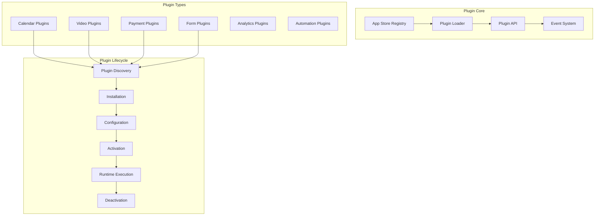
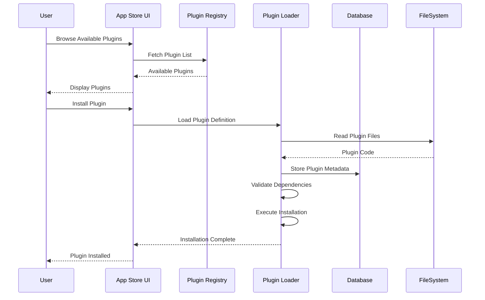
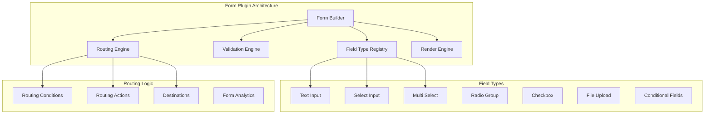
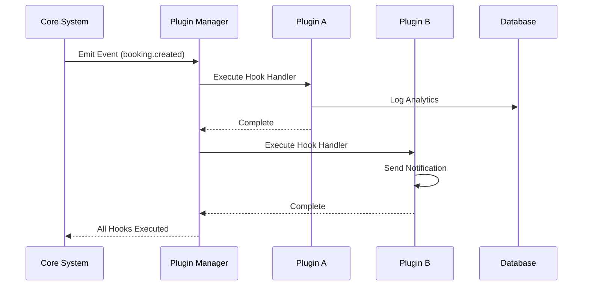
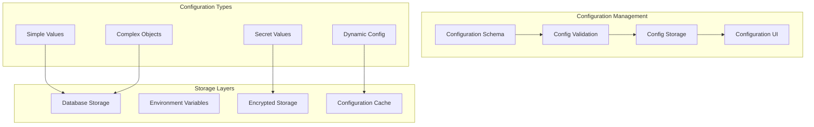
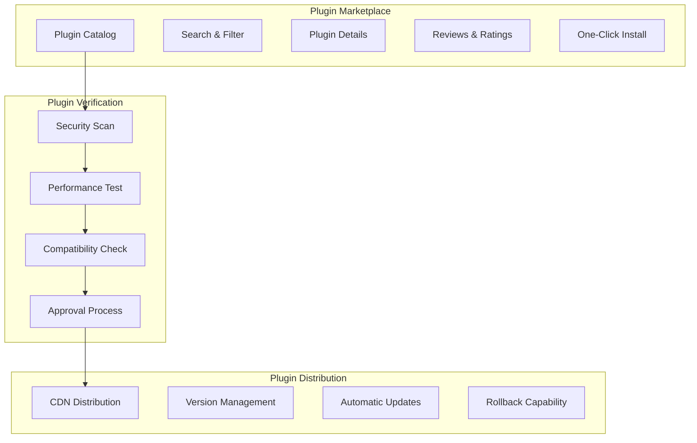

# Plugin System Architecture

Cal.com implements a sophisticated plugin system through its App Store architecture, enabling dynamic routing forms, extensible integrations, and customizable features. This system allows for runtime modification of application behavior without core code changes.

## Plugin System Overview



## App Store Architecture

### Plugin Registration System

```typescript
// Plugin metadata interface
interface PluginMetadata {
  name: string;
  slug: string;
  description: string;
  version: string;
  author: string;
  type: PluginType;
  categories: string[];
  dependencies?: string[];
  permissions: Permission[];
  configuration: ConfigurationSchema;
  hooks: HookRegistration[];
}

// Plugin base class
export abstract class BasePlugin {
  abstract metadata: PluginMetadata;

  abstract install(): Promise<void>;
  abstract uninstall(): Promise<void>;
  abstract configure(config: any): Promise<void>;
  abstract activate(): Promise<void>;
  abstract deactivate(): Promise<void>;

  // Hook system
  protected registerHook(hookName: string, handler: Function) {
    PluginManager.registerHook(this.metadata.slug, hookName, handler);
  }
}
```

### Plugin Discovery and Loading



### Dynamic Plugin Loading

```typescript
// Plugin loader implementation
export class PluginLoader {
  private static loadedPlugins = new Map<string, BasePlugin>();

  static async loadPlugin(pluginSlug: string): Promise<BasePlugin> {
    if (this.loadedPlugins.has(pluginSlug)) {
      return this.loadedPlugins.get(pluginSlug)!;
    }

    try {
      // Dynamic import for plugin code
      const pluginModule = await import(`@/app-store/${pluginSlug}`);
      const PluginClass = pluginModule.default;

      // Instantiate plugin
      const plugin = new PluginClass();

      // Validate plugin metadata
      this.validatePlugin(plugin);

      // Register plugin
      this.loadedPlugins.set(pluginSlug, plugin);

      return plugin;
    } catch (error) {
      throw new PluginLoadError(`Failed to load plugin: ${pluginSlug}`, error);
    }
  }

  static async installPlugin(pluginSlug: string, userId: number): Promise<void> {
    const plugin = await this.loadPlugin(pluginSlug);

    // Check permissions
    await this.checkPermissions(plugin, userId);

    // Install dependencies
    await this.installDependencies(plugin.metadata.dependencies);

    // Execute plugin installation
    await plugin.install();

    // Store installation record
    await prisma.appInstallation.create({
      data: {
        appSlug: pluginSlug,
        userId,
        status: 'installed',
        installedAt: new Date(),
      },
    });
  }
}
```

## Routing Forms Plugin System

### Dynamic Form Generation

Cal.com's routing forms demonstrate the plugin system's power through dynamic form generation and routing logic.



### Form Field Plugin Interface

```typescript
// Field plugin interface
interface FieldPlugin {
  type: string;
  name: string;
  icon: React.ComponentType;
  defaultProps: any;
  configSchema: z.ZodSchema;

  // Render components
  InputComponent: React.ComponentType<FieldInputProps>;
  ConfigComponent: React.ComponentType<FieldConfigProps>;
  PreviewComponent: React.ComponentType<FieldPreviewProps>;

  // Validation
  validate: (value: any, field: FieldDefinition) => ValidationResult;

  // Data processing
  processValue: (value: any, field: FieldDefinition) => any;
}

// Example: Phone number field plugin
export const PhoneFieldPlugin: FieldPlugin = {
  type: 'phone',
  name: 'Phone Number',
  icon: PhoneIcon,
  defaultProps: {
    required: false,
    placeholder: 'Enter phone number',
    format: 'international',
  },
  configSchema: z.object({
    required: z.boolean(),
    placeholder: z.string(),
    format: z.enum(['international', 'national', 'e164']),
    defaultCountry: z.string().optional(),
  }),

  InputComponent: ({ field, value, onChange, error }) => (
    <PhoneInput
      value={value}
      onChange={onChange}
      placeholder={field.placeholder}
      defaultCountry={field.defaultCountry}
      format={field.format}
      className={error ? 'border-red-500' : ''}
    />
  ),

  ConfigComponent: ({ field, onChange }) => (
    <PhoneFieldConfig field={field} onChange={onChange} />
  ),

  validate: (value, field) => {
    if (field.required && !value) {
      return { isValid: false, error: 'Phone number is required' };
    }

    if (value && !isValidPhoneNumber(value)) {
      return { isValid: false, error: 'Invalid phone number format' };
    }

    return { isValid: true };
  },

  processValue: (value, field) => {
    return field.format === 'e164' ? formatPhoneNumberE164(value) : value;
  },
};
```

### Dynamic Form Rendering

```typescript
// Dynamic form renderer
export function DynamicFormRenderer({ formDefinition, onSubmit }: DynamicFormProps) {
  const fieldPlugins = useFieldPlugins();
  const form = useForm({
    resolver: zodResolver(buildDynamicSchema(formDefinition.fields)),
  });

  const renderField = (field: FieldDefinition) => {
    const plugin = fieldPlugins.get(field.type);
    if (!plugin) {
      console.warn(`Unknown field type: ${field.type}`);
      return null;
    }

    const { InputComponent } = plugin;

    return (
      <FormField
        key={field.id}
        control={form.control}
        name={field.name}
        render={({ field: formField, fieldState }) => (
          <FormItem>
            <FormLabel>{field.label}</FormLabel>
            <FormControl>
              <InputComponent
                field={field}
                value={formField.value}
                onChange={formField.onChange}
                error={fieldState.error?.message}
              />
            </FormControl>
            {field.description && (
              <FormDescription>{field.description}</FormDescription>
            )}
            <FormMessage />
          </FormItem>
        )}
      />
    );
  };

  return (
    <Form {...form}>
      <form onSubmit={form.handleSubmit(onSubmit)} className="space-y-6">
        {formDefinition.fields.map(renderField)}
        <Button type="submit">Submit</Button>
      </form>
    </Form>
  );
}
```

## Plugin Hook System

### Event-Driven Architecture



### Hook Registration System

```typescript
// Hook system implementation
export class HookManager {
  private static hooks = new Map<string, HookHandler[]>();

  static registerHook(pluginId: string, hookName: string, handler: HookHandler) {
    const key = `${hookName}`;
    if (!this.hooks.has(key)) {
      this.hooks.set(key, []);
    }

    this.hooks.get(key)!.push({
      pluginId,
      handler,
      priority: handler.priority || 0,
    });

    // Sort by priority
    this.hooks.get(key)!.sort((a, b) => b.priority - a.priority);
  }

  static async executeHook(hookName: string, data: any): Promise<any> {
    const handlers = this.hooks.get(hookName) || [];
    let result = data;

    for (const { handler } of handlers) {
      try {
        result = await handler(result);
      } catch (error) {
        logger.error(`Hook execution failed: ${hookName}`, { error });
      }
    }

    return result;
  }

  static async executeHookParallel(hookName: string, data: any): Promise<any[]> {
    const handlers = this.hooks.get(hookName) || [];

    const promises = handlers.map(({ handler }) =>
      handler(data).catch(error => {
        logger.error(`Hook execution failed: ${hookName}`, { error });
        return null;
      })
    );

    return Promise.all(promises);
  }
}

// Usage in core system
export async function createBooking(bookingData: CreateBookingData) {
  // Pre-processing hooks
  const processedData = await HookManager.executeHook('booking.beforeCreate', bookingData);

  // Create booking
  const booking = await prisma.booking.create({ data: processedData });

  // Post-processing hooks (parallel execution)
  await HookManager.executeHookParallel('booking.afterCreate', booking);

  return booking;
}
```

### Available Hook Points

```typescript
// Hook definitions
export const CORE_HOOKS = {
  // Booking lifecycle
  'booking.beforeCreate': 'Before booking creation',
  'booking.afterCreate': 'After booking creation',
  'booking.beforeUpdate': 'Before booking update',
  'booking.afterUpdate': 'After booking update',
  'booking.beforeCancel': 'Before booking cancellation',
  'booking.afterCancel': 'After booking cancellation',

  // User lifecycle
  'user.beforeCreate': 'Before user creation',
  'user.afterCreate': 'After user creation',
  'user.beforeLogin': 'Before user login',
  'user.afterLogin': 'After user login',

  // Event type lifecycle
  'eventType.beforeCreate': 'Before event type creation',
  'eventType.afterCreate': 'After event type creation',

  // Payment lifecycle
  'payment.beforeProcess': 'Before payment processing',
  'payment.afterProcess': 'After payment processing',
  'payment.failed': 'Payment failed',

  // Calendar integration
  'calendar.beforeSync': 'Before calendar sync',
  'calendar.afterSync': 'After calendar sync',
  'calendar.eventCreated': 'Calendar event created',
} as const;
```

## Plugin Configuration System

### Configuration Schema



### Configuration Implementation

```typescript
// Plugin configuration system
export class PluginConfig {
  private static cache = new Map<string, any>();

  static async getConfig<T>(pluginSlug: string): Promise<T> {
    const cacheKey = `plugin:${pluginSlug}:config`;

    if (this.cache.has(cacheKey)) {
      return this.cache.get(cacheKey);
    }

    const installation = await prisma.appInstallation.findFirst({
      where: { appSlug: pluginSlug },
      include: { credentials: true },
    });

    if (!installation) {
      throw new Error(`Plugin not installed: ${pluginSlug}`);
    }

    const config = {
      ...installation.settings,
      credentials: installation.credentials.reduce((acc, cred) => ({
        ...acc,
        [cred.type]: JSON.parse(cred.key),
      }), {}),
    };

    this.cache.set(cacheKey, config);
    return config;
  }

  static async updateConfig(pluginSlug: string, config: any): Promise<void> {
    const plugin = await PluginLoader.loadPlugin(pluginSlug);

    // Validate configuration
    const validation = plugin.metadata.configuration.safeParse(config);
    if (!validation.success) {
      throw new ConfigurationError('Invalid configuration', validation.error);
    }

    // Update configuration
    await prisma.appInstallation.update({
      where: { appSlug: pluginSlug },
      data: { settings: config },
    });

    // Clear cache
    this.cache.delete(`plugin:${pluginSlug}:config`);

    // Notify plugin of configuration change
    await plugin.configure(config);
  }
}
```

## Plugin Security Model

### Permission System

```typescript
// Plugin permission system
export enum PluginPermission {
  READ_BOOKINGS = 'read:bookings',
  WRITE_BOOKINGS = 'write:bookings',
  READ_USERS = 'read:users',
  WRITE_USERS = 'write:users',
  READ_CALENDAR = 'read:calendar',
  WRITE_CALENDAR = 'write:calendar',
  EXTERNAL_HTTP = 'external:http',
  FILE_SYSTEM = 'system:filesystem',
}

export class PluginSecurity {
  static async checkPermission(
    pluginSlug: string,
    permission: PluginPermission,
    context?: any
  ): Promise<boolean> {
    const plugin = await PluginLoader.loadPlugin(pluginSlug);

    // Check if plugin has requested permission
    if (!plugin.metadata.permissions.includes(permission)) {
      return false;
    }

    // Check user consent
    const installation = await prisma.appInstallation.findFirst({
      where: { appSlug: pluginSlug },
    });

    if (!installation?.permissions.includes(permission)) {
      return false;
    }

    // Context-specific checks
    if (context && permission === PluginPermission.READ_BOOKINGS) {
      return this.checkBookingAccess(context.userId, context.bookingId);
    }

    return true;
  }

  static createSecureWrapper<T>(
    pluginSlug: string,
    permission: PluginPermission,
    fn: (...args: any[]) => T
  ) {
    return async (...args: any[]): Promise<T> => {
      const hasPermission = await this.checkPermission(pluginSlug, permission);
      if (!hasPermission) {
        throw new SecurityError(`Permission denied: ${permission}`);
      }
      return fn(...args);
    };
  }
}
```

## Plugin Development Framework

### Plugin Development Kit

```typescript
// Plugin SDK
export class PluginSDK {
  constructor(private pluginSlug: string) {}

  // Secure API methods
  async getBookings(userId: number) {
    return PluginSecurity.createSecureWrapper(
      this.pluginSlug,
      PluginPermission.READ_BOOKINGS,
      () => prisma.booking.findMany({ where: { userId } })
    )();
  }

  async createBooking(data: CreateBookingData) {
    return PluginSecurity.createSecureWrapper(
      this.pluginSlug,
      PluginPermission.WRITE_BOOKINGS,
      () => bookingService.create(data)
    )();
  }

  async sendNotification(notification: NotificationData) {
    return PluginSecurity.createSecureWrapper(
      this.pluginSlug,
      PluginPermission.EXTERNAL_HTTP,
      () => notificationService.send(notification)
    )();
  }

  // Configuration helpers
  async getConfig<T>(): Promise<T> {
    return PluginConfig.getConfig(this.pluginSlug);
  }

  // Hook registration
  registerHook(hookName: string, handler: HookHandler) {
    HookManager.registerHook(this.pluginSlug, hookName, handler);
  }

  // UI components
  createConfigUI(schema: ConfigSchema) {
    return generateConfigurationUI(schema);
  }
}

// Plugin template
export abstract class CalComPlugin extends BasePlugin {
  protected sdk: PluginSDK;

  constructor() {
    super();
    this.sdk = new PluginSDK(this.metadata.slug);
  }

  // Lifecycle methods that plugins can override
  async onInstall(): Promise<void> {}
  async onUninstall(): Promise<void> {}
  async onConfigUpdate(config: any): Promise<void> {}
  async onActivate(): Promise<void> {}
  async onDeactivate(): Promise<void> {}
}
```

## Plugin Marketplace

### Plugin Distribution



This plugin system architecture enables Cal.com to be highly extensible while maintaining security, performance, and reliability. The combination of dynamic loading, secure permissions, and standardized interfaces allows third-party developers to extend Cal.com's functionality without compromising the core system.
