# Request/Response Lifecycle

Cal.com's request/response lifecycle is built around Next.js's App Router and tRPC, providing both traditional HTTP API endpoints and type-safe procedure calls. The system handles multiple types of requests including web pages, API calls, webhooks, and real-time updates.

## Overview of Request Flow

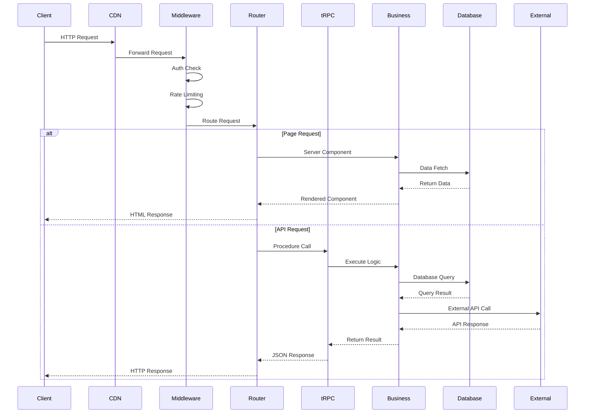

## Request Types and Routing

### 1. Page Requests (App Router)

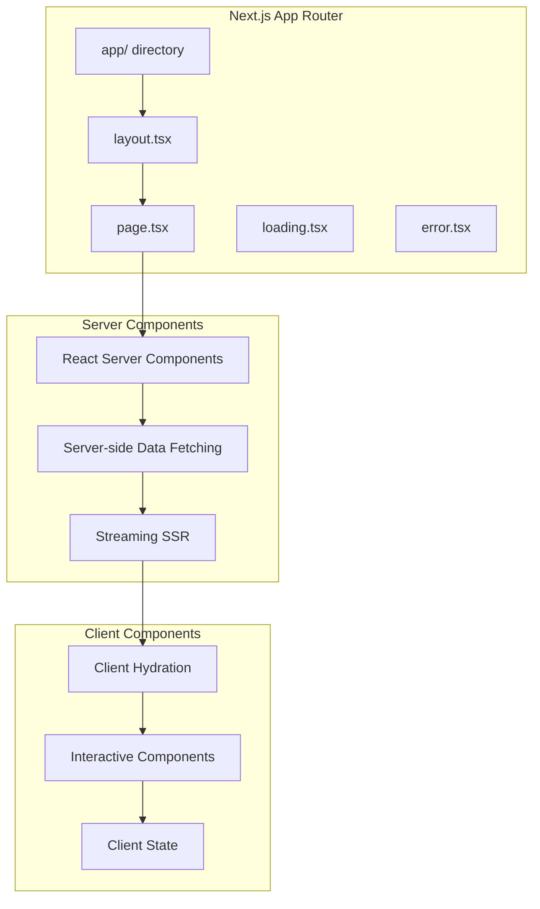

**Flow Details:**
1. **Route Resolution**: Next.js matches URL to file system structure
2. **Layout Rendering**: Nested layouts provide consistent structure
3. **Server Components**: Data fetching and initial rendering on server
4. **Streaming**: Progressive page loading with React 18 Suspense
5. **Client Hydration**: JavaScript loads for interactivity

### 2. tRPC API Requests

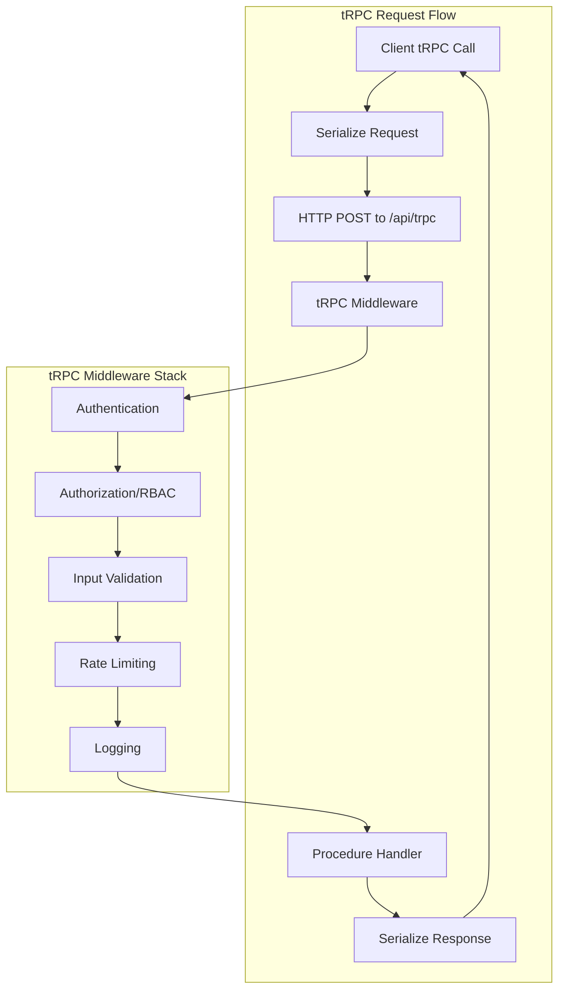

**tRPC Router Structure:**
```typescript
// packages/trpc/server/routers/
viewer/          # Authenticated user operations
├── me.ts       # User profile operations
├── teams.ts    # Team management
├── bookings.ts # Booking operations
└── ...

admin/          # Admin-only operations
├── users.ts    # User administration
├── features.ts # Feature toggles
└── ...

public/         # Public operations (no auth)
├── event.ts    # Public event data
├── booking.ts  # Public booking flow
└── ...
```

### 3. REST API Endpoints

Cal.com maintains REST endpoints for external integrations and webhooks.

```mermaid
graph LR
    subgraph "API v1 (Legacy)"
        V1Auth[/api/auth/*]
        V1Webhook[/api/webhook/*]
        V1Integration[/api/integrations/*]
    end

    subgraph "API v2 (Platform)"
        V2Auth[/api/v2/auth/*]
        V2Bookings[/api/v2/bookings/*]
        V2Events[/api/v2/event-types/*]
        V2Calendar[/api/v2/calendars/*]
    end

    subgraph "Internal APIs"
        TRPC[/api/trpc/*]
        Health[/api/health]
        Cron[/api/cron/*]
    end
```

## Middleware Chain

Cal.com uses Next.js middleware for cross-cutting concerns that need to run before route handlers.

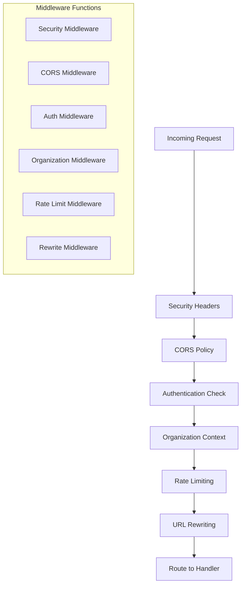

**Middleware Implementation:**
```typescript
// apps/web/middleware.ts
export async function middleware(request: NextRequest) {
  // 1. Security headers
  const response = addSecurityHeaders(request);

  // 2. CORS handling
  if (isCorsRequest(request)) {
    return handleCors(request, response);
  }

  // 3. Authentication
  const session = await getSession(request);
  if (requiresAuth(request.url) && !session) {
    return redirectToLogin(request);
  }

  // 4. Organization context
  const orgSlug = extractOrgSlug(request);
  if (orgSlug) {
    response.headers.set('x-cal-org-slug', orgSlug);
  }

  // 5. Rate limiting
  const rateLimitResult = await checkRateLimit(request);
  if (rateLimitResult.blocked) {
    return new Response('Rate Limited', { status: 429 });
  }

  // 6. URL rewriting for multi-tenancy
  if (shouldRewrite(request)) {
    return rewriteUrl(request, response);
  }

  return response;
}
```

## Data Fetching Patterns

### Server-Side Data Fetching

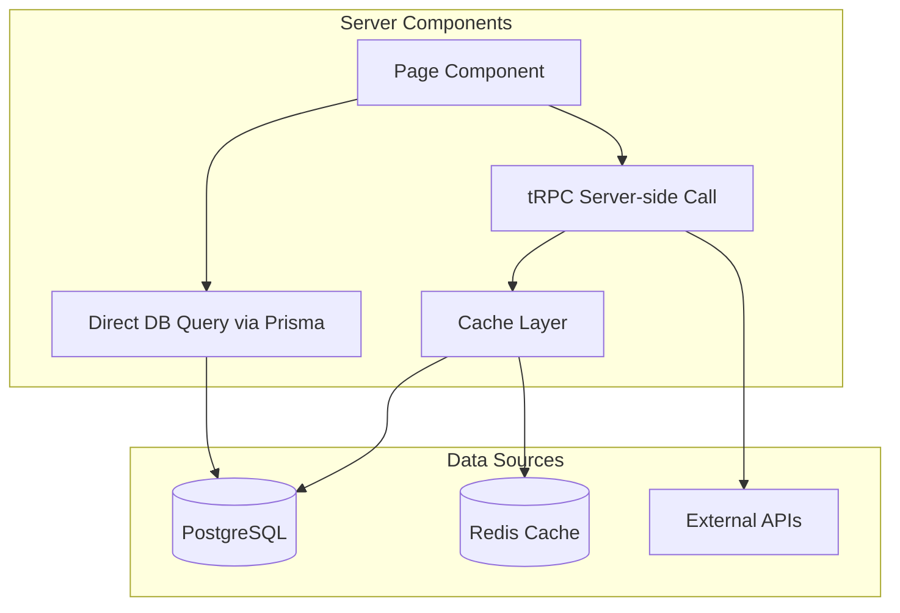

### Client-Side Data Fetching

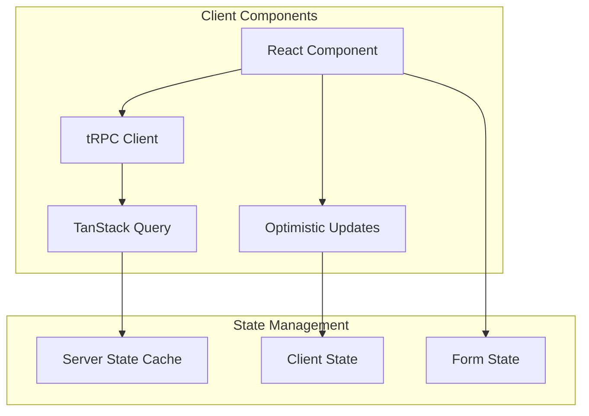

## Authentication Flow

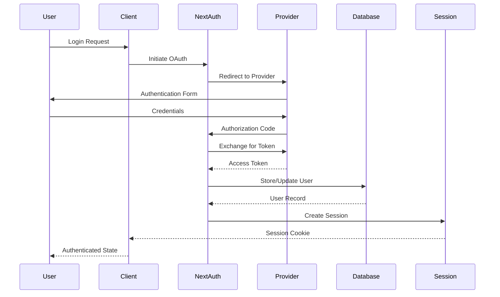

## Error Handling

### Error Boundary Pattern

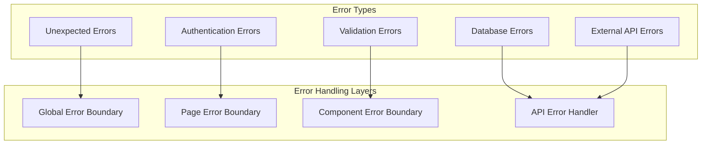

### tRPC Error Handling

```typescript
// Error handling in tRPC procedures
export const bookingRouter = createTRPCRouter({
  create: protectedProcedure
    .input(createBookingSchema)
    .mutation(async ({ input, ctx }) => {
      try {
        // Validate business rules
        const validation = await validateBookingRequest(input);
        if (!validation.success) {
          throw new TRPCError({
            code: 'BAD_REQUEST',
            message: validation.error,
          });
        }

        // Create booking
        const booking = await ctx.prisma.booking.create({
          data: input,
        });

        return booking;
      } catch (error) {
        // Log error for monitoring
        logger.error('Booking creation failed', { error, input });

        // Re-throw with appropriate error code
        if (error instanceof TRPCError) {
          throw error;
        }

        throw new TRPCError({
          code: 'INTERNAL_SERVER_ERROR',
          message: 'Failed to create booking',
          cause: error,
        });
      }
    }),
});
```

## Caching Strategy

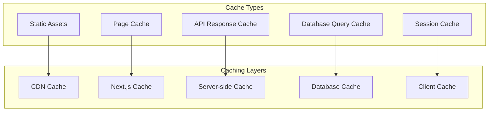

### Cache Implementation

```typescript
// Server-side caching with Redis
export async function getCachedUserBookings(userId: string) {
  const cacheKey = `user:${userId}:bookings`;

  // Try cache first
  const cached = await redis.get(cacheKey);
  if (cached) {
    return JSON.parse(cached);
  }

  // Fetch from database
  const bookings = await prisma.booking.findMany({
    where: { userId },
    include: { eventType: true },
  });

  // Cache for 5 minutes
  await redis.setex(cacheKey, 300, JSON.stringify(bookings));

  return bookings;
}

// Client-side caching with TanStack Query
export function useUserBookings() {
  return trpc.viewer.bookings.list.useQuery(undefined, {
    staleTime: 5 * 60 * 1000, // 5 minutes
    cacheTime: 10 * 60 * 1000, // 10 minutes
    refetchOnWindowFocus: false,
  });
}
```

## Real-time Updates

For features requiring real-time updates, Cal.com uses Server-Sent Events and WebSockets.

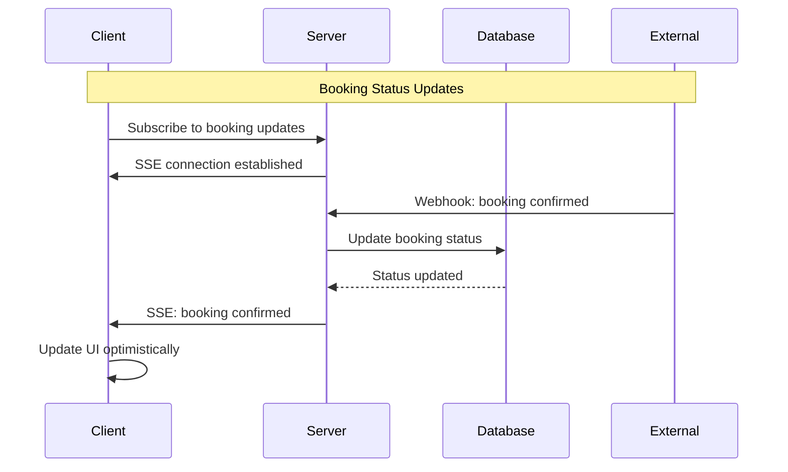

## Performance Optimizations

### Request Optimization

1. **Connection Pooling**: Database connections managed by Prisma
2. **Query Optimization**: N+1 query prevention with Prisma includes
3. **Response Compression**: gzip/brotli compression
4. **CDN Integration**: Static assets served from CDN
5. **Edge Computing**: Some routes deployed to edge functions

### Monitoring and Observability

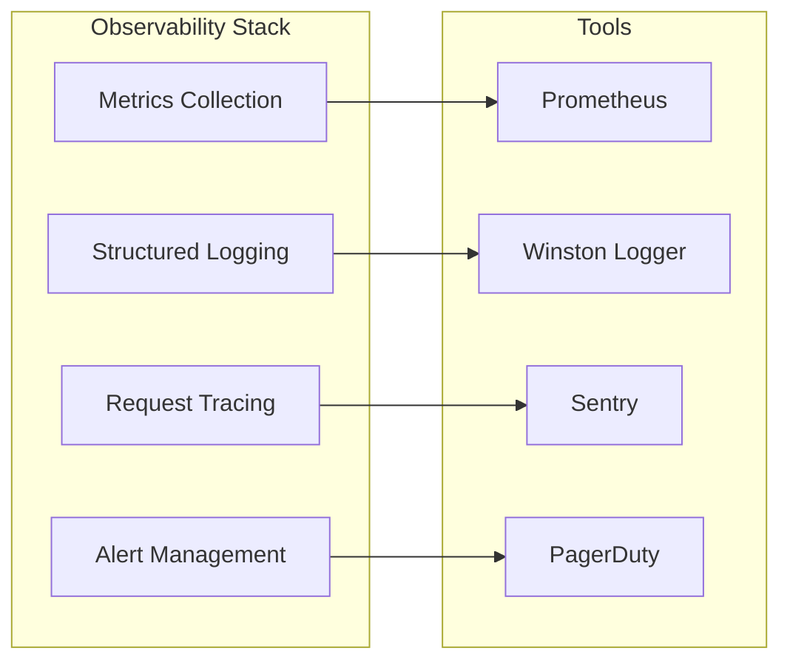

## Best Practices

### Request Handling

1. **Validation**: Always validate input at API boundaries
2. **Authorization**: Check permissions for every protected operation
3. **Error Handling**: Provide meaningful error messages
4. **Rate Limiting**: Protect against abuse and DoS attacks
5. **Logging**: Log important events for debugging and monitoring

### Performance

1. **Minimize Database Queries**: Use efficient query patterns
2. **Cache Appropriately**: Cache expensive operations
3. **Optimize Bundle Size**: Code splitting and lazy loading
4. **Use Server Components**: Reduce client-side JavaScript
5. **Monitor Performance**: Track key metrics and optimize bottlenecks
