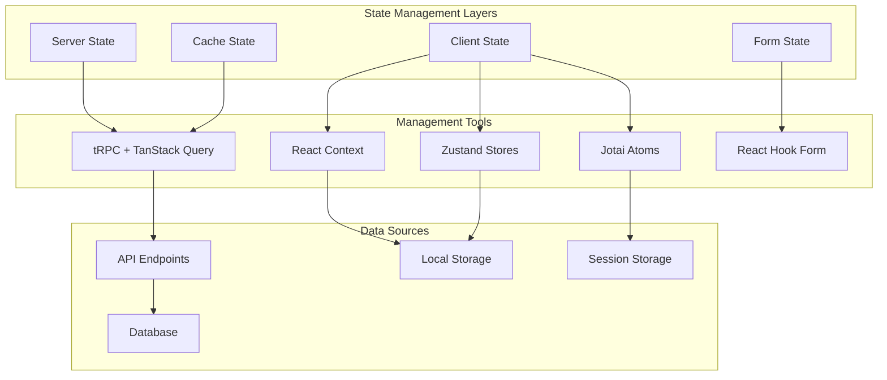
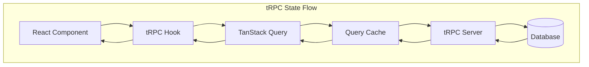
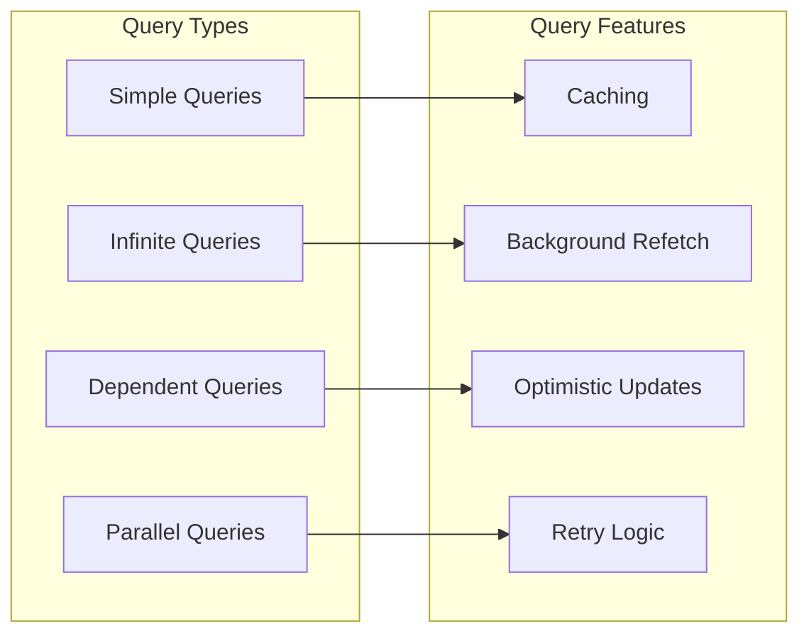
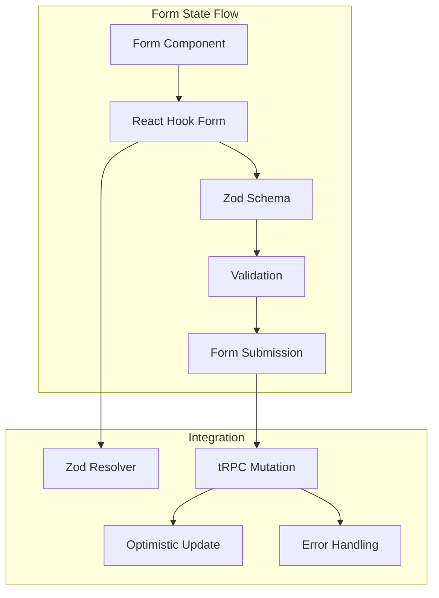
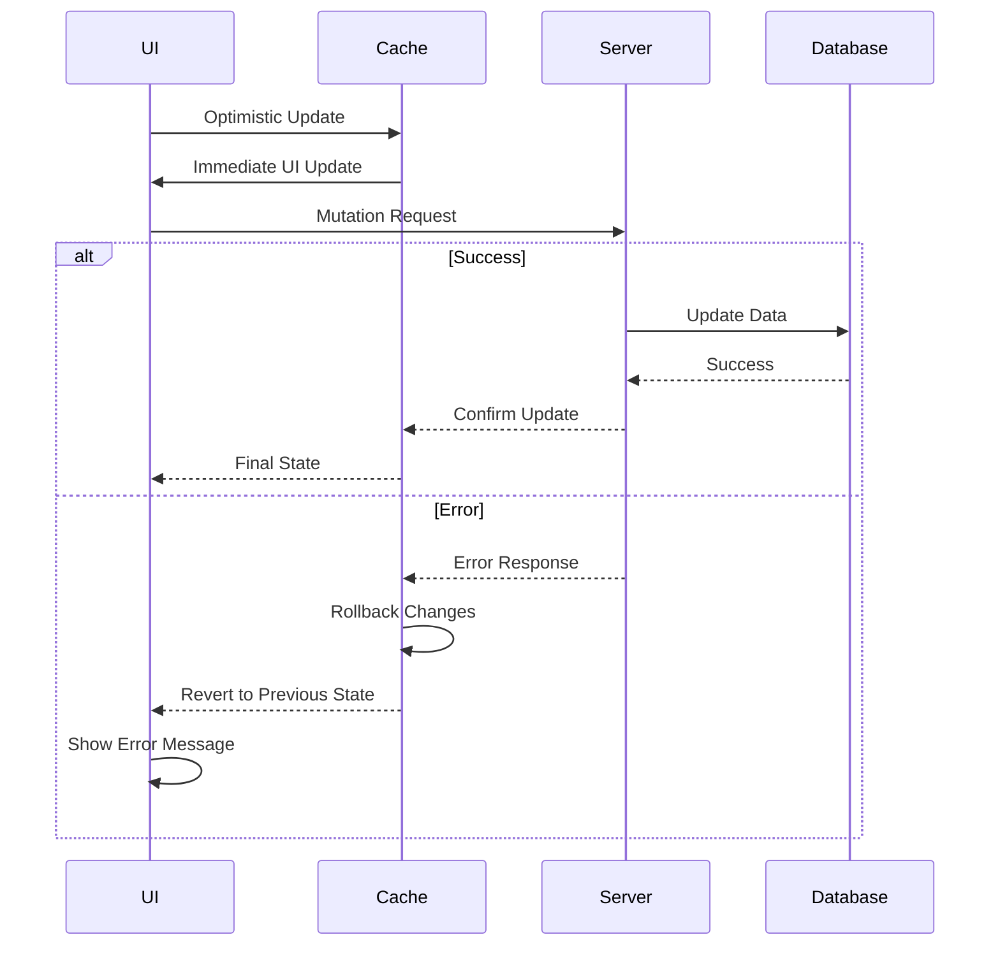

# State Management

Cal.com employs a multi-layered state management strategy that combines server state, client state, and form state management. The architecture is designed to provide optimal user experience while maintaining data consistency and type safety.

## State Management Overview



## Server State Management

### tRPC with TanStack Query

Cal.com uses tRPC with TanStack Query for server state management, providing type-safe API calls with intelligent caching.



**Implementation Example:**

```typescript
// Client-side usage
export function BookingsList() {
  const { data: bookings, isLoading, error } = trpc.viewer.bookings.list.useQuery({
    limit: 10,
    status: 'confirmed'
  });

  const utils = trpc.useContext();
  const createBooking = trpc.viewer.bookings.create.useMutation({
    onSuccess: () => {
      // Invalidate and refetch bookings
      utils.viewer.bookings.list.invalidate();
    },
    onMutate: async (newBooking) => {
      // Optimistic update
      await utils.viewer.bookings.list.cancel();
      const previousBookings = utils.viewer.bookings.list.getData();

      utils.viewer.bookings.list.setData(undefined, (old) =>
        old ? [...old, { ...newBooking, id: 'temp' }] : [{ ...newBooking, id: 'temp' }]
      );

      return { previousBookings };
    },
    onError: (err, newBooking, context) => {
      // Rollback on error
      utils.viewer.bookings.list.setData(undefined, context?.previousBookings);
    }
  });

  return (
    <div>
      {isLoading && <div>Loading...</div>}
      {error && <div>Error: {error.message}</div>}
      {bookings?.map(booking => (
        <BookingItem key={booking.id} booking={booking} />
      ))}
    </div>
  );
}
```

### Query Patterns



**Query Configuration:**

```typescript
// Global query configuration
export const trpcConfig = {
  queries: {
    staleTime: 5 * 60 * 1000, // 5 minutes
    cacheTime: 10 * 60 * 1000, // 10 minutes
    refetchOnWindowFocus: false,
    retry: (failureCount, error) => {
      // Don't retry on 4xx errors
      if (error.data?.httpStatus >= 400 && error.data?.httpStatus < 500) {
        return false;
      }
      return failureCount < 3;
    }
  },
  mutations: {
    retry: false,
  }
};
```

## Client State Management

### React Context for Component Trees

Used for state that needs to be shared across component trees but doesn't require global access.

```typescript
// Organization context example
interface OrganizationContextType {
  organization: Organization | null;
  isLoading: boolean;
  switchOrganization: (orgId: string) => Promise<void>;
}

const OrganizationContext = createContext<OrganizationContextType | undefined>(undefined);

export function OrganizationProvider({ children }: { children: ReactNode }) {
  const [organization, setOrganization] = useState<Organization | null>(null);
  const [isLoading, setIsLoading] = useState(true);

  const switchOrganization = useCallback(async (orgId: string) => {
    setIsLoading(true);
    try {
      const org = await fetchOrganization(orgId);
      setOrganization(org);
    } finally {
      setIsLoading(false);
    }
  }, []);

  return (
    <OrganizationContext.Provider value={{ organization, isLoading, switchOrganization }}>
      {children}
    </OrganizationContext.Provider>
  );
}
```

### Zustand for Global State

Used for global application state that needs to persist across route changes.

```typescript
// Theme store example
interface ThemeStore {
  theme: 'light' | 'dark' | 'system';
  resolvedTheme: 'light' | 'dark';
  setTheme: (theme: 'light' | 'dark' | 'system') => void;
}

export const useThemeStore = create<ThemeStore>()(
  persist(
    (set, get) => ({
      theme: 'system',
      resolvedTheme: 'light',
      setTheme: (theme) => {
        set({ theme });
        const resolvedTheme = theme === 'system'
          ? window.matchMedia('(prefers-color-scheme: dark)').matches ? 'dark' : 'light'
          : theme;
        set({ resolvedTheme });
        document.documentElement.classList.toggle('dark', resolvedTheme === 'dark');
      }
    }),
    {
      name: 'cal-theme',
      storage: createJSONStorage(() => localStorage),
    }
  )
);
```

### Jotai for Atomic State

Used for fine-grained state management and derived state.

```typescript
// Booking flow state atoms
export const selectedDateAtom = atom<Date | null>(null);
export const selectedTimeAtom = atom<string | null>(null);
export const bookingFormDataAtom = atom<Partial<BookingFormData>>({});

// Derived atom for booking availability
export const availabilityAtom = atom(async (get) => {
  const date = get(selectedDateAtom);
  const eventTypeId = get(eventTypeIdAtom);

  if (!date || !eventTypeId) return null;

  const response = await fetch(`/api/availability?date=${date}&eventType=${eventTypeId}`);
  return response.json();
});

// Atom with write action
export const bookingStateAtom = atom(
  (get) => ({
    date: get(selectedDateAtom),
    time: get(selectedTimeAtom),
    formData: get(bookingFormDataAtom),
  }),
  (get, set, update: Partial<BookingState>) => {
    if (update.date !== undefined) set(selectedDateAtom, update.date);
    if (update.time !== undefined) set(selectedTimeAtom, update.time);
    if (update.formData !== undefined) set(bookingFormDataAtom, update.formData);
  }
);
```

## Form State Management

### React Hook Form Integration

Cal.com extensively uses React Hook Form for form state management with schema validation.



**Form Implementation:**

```typescript
// Event type form example
const eventTypeSchema = z.object({
  title: z.string().min(1, "Title is required"),
  length: z.number().min(1).max(720),
  description: z.string().optional(),
  price: z.number().min(0).optional(),
  locations: z.array(locationSchema),
});

type EventTypeFormData = z.infer<typeof eventTypeSchema>;

export function EventTypeForm({ eventType }: { eventType?: EventType }) {
  const utils = trpc.useContext();

  const form = useForm<EventTypeFormData>({
    resolver: zodResolver(eventTypeSchema),
    defaultValues: eventType || {
      title: "",
      length: 30,
      description: "",
      locations: [],
    },
  });

  const createMutation = trpc.viewer.eventTypes.create.useMutation({
    onSuccess: () => {
      utils.viewer.eventTypes.list.invalidate();
      form.reset();
    },
    onError: (error) => {
      // Handle server-side validation errors
      if (error.data?.zodError) {
        const fieldErrors = error.data.zodError.fieldErrors;
        Object.keys(fieldErrors).forEach(field => {
          form.setError(field as keyof EventTypeFormData, {
            message: fieldErrors[field]?.[0]
          });
        });
      }
    }
  });

  const onSubmit = (data: EventTypeFormData) => {
    createMutation.mutate(data);
  };

  return (
    <form onSubmit={form.handleSubmit(onSubmit)}>
      <FormField
        control={form.control}
        name="title"
        render={({ field }) => (
          <FormItem>
            <FormLabel>Event Title</FormLabel>
            <FormControl>
              <Input {...field} />
            </FormControl>
            <FormMessage />
          </FormItem>
        )}
      />
      {/* Other form fields */}
      <Button type="submit" disabled={createMutation.isLoading}>
        {createMutation.isLoading ? "Creating..." : "Create Event Type"}
      </Button>
    </form>
  );
}
```

### Dynamic Form Generation

For routing forms and custom fields, Cal.com uses dynamic form generation.

```typescript
// Dynamic form builder
export function DynamicForm({ formDefinition }: { formDefinition: FormDefinition }) {
  const schema = useMemo(() => buildZodSchema(formDefinition.fields), [formDefinition]);

  const form = useForm({
    resolver: zodResolver(schema),
    defaultValues: getDefaultValues(formDefinition.fields),
  });

  return (
    <Form {...form}>
      <form onSubmit={form.handleSubmit(onSubmit)}>
        {formDefinition.fields.map(field => (
          <DynamicField
            key={field.name}
            field={field}
            control={form.control}
          />
        ))}
      </form>
    </Form>
  );
}

function DynamicField({ field, control }: { field: FieldDefinition, control: Control }) {
  switch (field.type) {
    case 'text':
      return <TextInput field={field} control={control} />;
    case 'select':
      return <SelectInput field={field} control={control} />;
    case 'multiselect':
      return <MultiSelectInput field={field} control={control} />;
    default:
      return null;
  }
}
```

## State Synchronization Patterns

### Optimistic Updates



### Real-time Synchronization

For collaborative features, Cal.com uses WebSocket connections and Server-Sent Events.

```typescript
// Real-time booking updates
export function useRealtimeBookings(eventTypeId: string) {
  const utils = trpc.useContext();

  useEffect(() => {
    const eventSource = new EventSource(`/api/sse/bookings?eventType=${eventTypeId}`);

    eventSource.onmessage = (event) => {
      const update = JSON.parse(event.data);

      // Update the cache with real-time data
      utils.viewer.bookings.list.setData(undefined, (old) => {
        if (!old) return old;

        return old.map(booking =>
          booking.id === update.bookingId
            ? { ...booking, ...update.changes }
            : booking
        );
      });
    };

    return () => eventSource.close();
  }, [eventTypeId, utils]);
}
```

## State Persistence

### Local Storage Strategy

```typescript
// Persistent state configuration
const persistentStores = {
  theme: localStorage,
  preferences: localStorage,
  draftForms: sessionStorage,
  recentSearches: localStorage,
};

// Form draft auto-save
export function useFormDraftSave(formId: string) {
  const { watch, setValue } = useFormContext();
  const formData = watch();

  // Save draft every 30 seconds
  useEffect(() => {
    const interval = setInterval(() => {
      sessionStorage.setItem(`draft_${formId}`, JSON.stringify(formData));
    }, 30000);

    return () => clearInterval(interval);
  }, [formId, formData]);

  // Load draft on mount
  useEffect(() => {
    const draft = sessionStorage.getItem(`draft_${formId}`);
    if (draft) {
      const draftData = JSON.parse(draft);
      Object.keys(draftData).forEach(key => {
        setValue(key, draftData[key]);
      });
    }
  }, [formId, setValue]);
}
```

## Performance Optimizations

### Memoization and Optimization

```typescript
// Optimized component with proper memoization
export const BookingCard = memo(function BookingCard({ booking }: { booking: Booking }) {
  const utils = trpc.useContext();

  const updateStatus = useMutation({
    mutationFn: (status: BookingStatus) =>
      updateBookingStatus({ bookingId: booking.id, status }),
    onMutate: async (status) => {
      // Optimistic update
      const previousBookings = utils.viewer.bookings.list.getData();
      utils.viewer.bookings.list.setData(undefined, (old) =>
        old?.map(b => b.id === booking.id ? { ...b, status } : b)
      );
      return { previousBookings };
    }
  });

  // Memoize expensive calculations
  const formattedDate = useMemo(() =>
    formatBookingDate(booking.startTime),
    [booking.startTime]
  );

  return (
    <div>
      {/* Booking card content */}
    </div>
  );
});
```

### Selective Re-rendering

```typescript
// Use selectors to prevent unnecessary re-renders
export function useBookingStatus(bookingId: string) {
  return trpc.viewer.bookings.list.useQuery(undefined, {
    select: (data) => data?.find(b => b.id === bookingId)?.status,
    enabled: !!bookingId,
  });
}

// Atomic updates with Jotai
export const bookingStatusFamily = atomFamily((bookingId: string) =>
  atom<BookingStatus | undefined>(undefined)
);
```

## Best Practices

### State Management Guidelines

1. **Server State**: Use tRPC + TanStack Query for all server-related state
2. **Client State**: Use React Context for component tree state, Zustand for global state
3. **Form State**: Use React Hook Form with Zod validation
4. **Derived State**: Use useMemo and useCallback for expensive computations
5. **Persistence**: Use appropriate storage (localStorage vs sessionStorage)

### Performance Best Practices

1. **Selective Subscriptions**: Only subscribe to the data you need
2. **Optimistic Updates**: Provide immediate feedback for better UX
3. **Proper Memoization**: Prevent unnecessary re-renders
4. **Batch Updates**: Group related state updates
5. **Error Boundaries**: Handle state errors gracefully

### Testing State Management

```typescript
// Testing tRPC hooks
import { renderHook, waitFor } from '@testing-library/react';
import { createTRPCMsw } from 'msw-trpc';
import { trpc } from '../utils/trpc';

const trpcMsw = createTRPCMsw(appRouter);

test('should fetch bookings correctly', async () => {
  // Mock the API response
  trpcMsw.viewer.bookings.list.query(() => {
    return [
      { id: '1', title: 'Test Booking', status: 'confirmed' }
    ];
  });

  const { result } = renderHook(() => trpc.viewer.bookings.list.useQuery(), {
    wrapper: TRPCWrapper,
  });

  await waitFor(() => {
    expect(result.current.isSuccess).toBe(true);
    expect(result.current.data).toHaveLength(1);
  });
});
```
