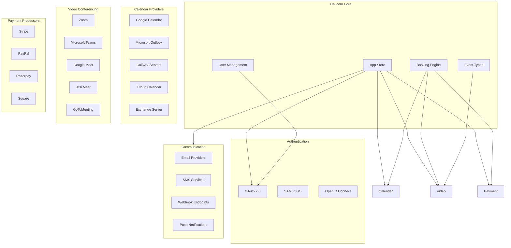
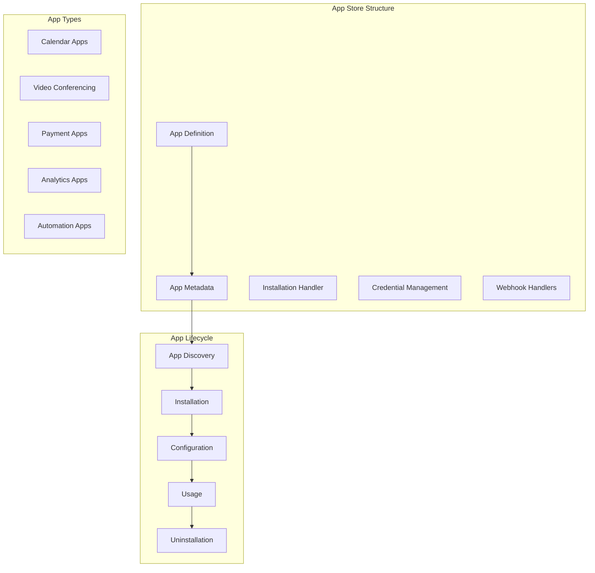
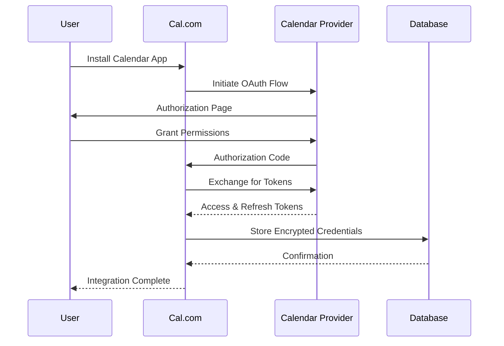
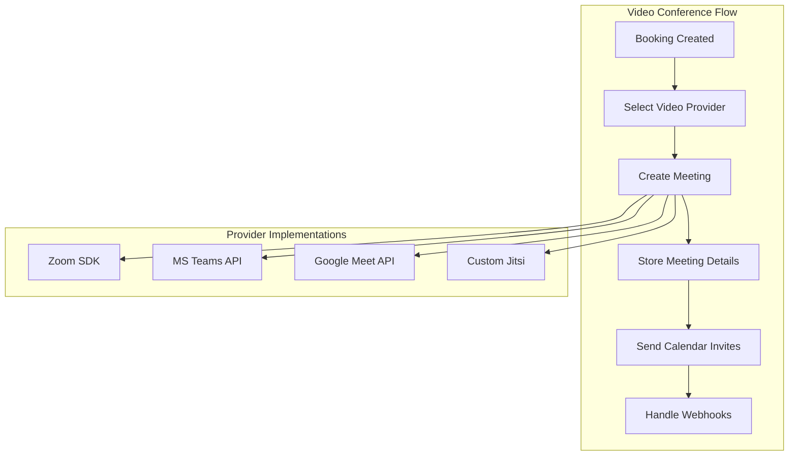
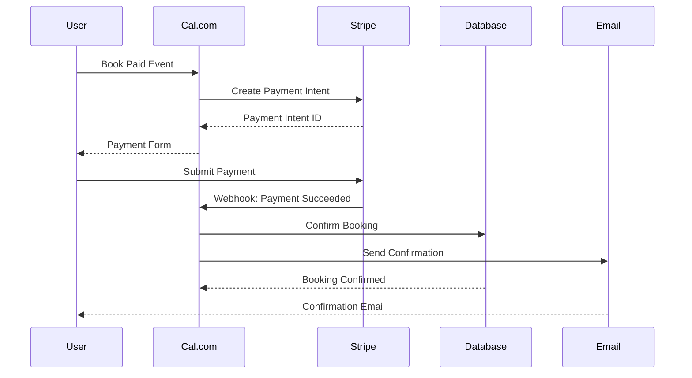
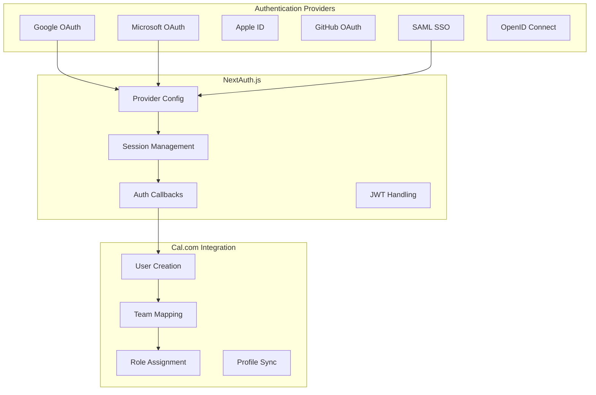
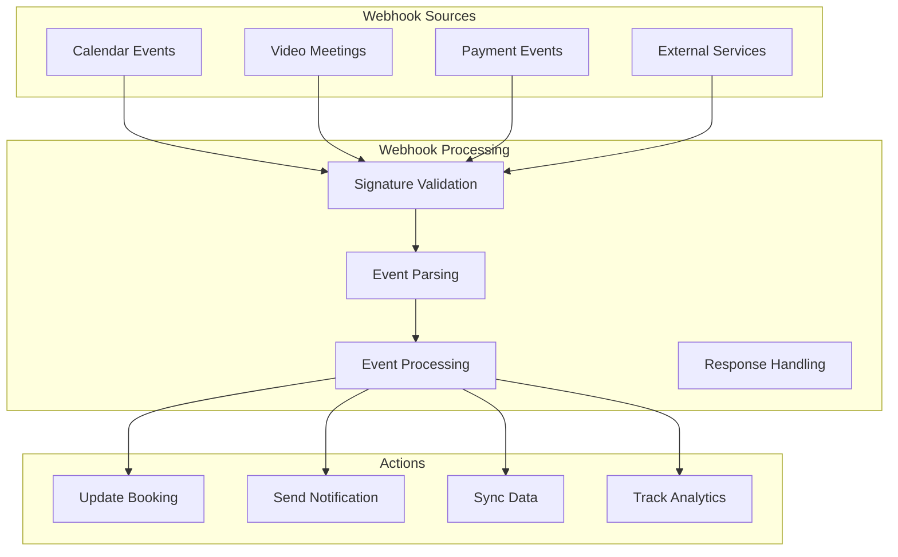
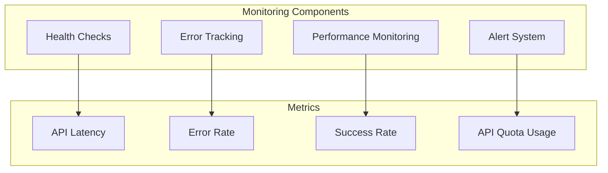

# Third-Party Integrations

Cal.com's architecture is built around extensive third-party integrations that enable calendar synchronization, video conferencing, payments, authentication, and more. The system uses a plugin-based architecture to manage these integrations in a scalable and maintainable way.

## Integration Architecture Overview



## App Store Architecture

Cal.com uses a plugin-based app store architecture that allows for easy integration of third-party services.



### App Definition Structure

```typescript
// packages/app-store/[app]/config.ts
export const metadata: AppMeta = {
  name: "Google Calendar",
  description: "Connect your Google Calendar to automatically check for busy times",
  type: "google_calendar",
  imageSrc: "/api/app-store/googlecalendar/icon.svg",
  variant: "calendar",
  categories: ["calendar"],
  publisher: "Cal.com",
  url: "https://calendar.google.com/",
  verified: true,
  rating: 5,
  reviews: 69,
  trending: true,
  paid: false,
  requiresServer: false,
  email: "help@cal.com",
  dirName: "googlecalendar",
};

export default {
  metadata,
  // App-specific configuration
  appData: {
    location: {
      linkType: "dynamic",
      type: "integrations:google:meet",
      label: "Google Meet",
    },
  },
} as App;
```

## Calendar Integration Patterns

### OAuth Flow for Calendar Providers



### Calendar Service Implementation

```typescript
// Calendar service interface
export interface CalendarService {
  createEvent(event: CalendarEvent): Promise<NewCalendarEventType>;
  updateEvent(uid: string, event: CalendarEvent): Promise<NewCalendarEventType>;
  deleteEvent(uid: string): Promise<void>;
  getAvailability(
    dateFrom: string,
    dateTo: string,
    selectedCalendars: IntegrationCalendar[]
  ): Promise<EventBusyDate[]>;
  listCalendars(): Promise<IntegrationCalendar[]>;
}

// Google Calendar implementation
export class GoogleCalendarService implements CalendarService {
  constructor(private credential: Credential) {}

  async createEvent(event: CalendarEvent): Promise<NewCalendarEventType> {
    const auth = this.getGoogleAuth();
    const calendar = google.calendar({ version: 'v3', auth });

    const googleEvent = {
      summary: event.title,
      description: event.description,
      start: {
        dateTime: event.startTime,
        timeZone: event.organizer.timeZone,
      },
      end: {
        dateTime: event.endTime,
        timeZone: event.organizer.timeZone,
      },
      attendees: event.attendees.map(attendee => ({
        email: attendee.email,
        displayName: attendee.name,
      })),
      conferenceData: event.location?.type === 'integrations:google:meet' ? {
        createRequest: {
          requestId: uuidv4(),
          conferenceSolutionKey: { type: 'hangoutsMeet' },
        },
      } : undefined,
    };

    const response = await calendar.events.insert({
      calendarId: 'primary',
      resource: googleEvent,
      conferenceDataVersion: 1,
    });

    return {
      uid: response.data.id!,
      id: response.data.id!,
      type: 'google_calendar',
      password: '',
      url: response.data.hangoutLink || '',
      additionalInfo: response.data,
    };
  }

  private getGoogleAuth() {
    const oauth2Client = new google.auth.OAuth2(
      process.env.GOOGLE_API_CREDENTIALS?.client_id,
      process.env.GOOGLE_API_CREDENTIALS?.client_secret,
      process.env.GOOGLE_API_CREDENTIALS?.redirect_uris[0]
    );

    oauth2Client.setCredentials({
      refresh_token: this.credential.key.refresh_token,
      access_token: this.credential.key.access_token,
    });

    return oauth2Client;
  }
}
```

## Video Conferencing Integrations

### Video Provider Architecture



### Video Provider Implementation

```typescript
// Video meeting interface
export interface VideoApiAdapter {
  createMeeting(event: CalendarEvent): Promise<VideoCallData>;
  updateMeeting(uid: string, event: CalendarEvent): Promise<VideoCallData>;
  deleteMeeting(uid: string): Promise<void>;
}

// Zoom implementation
export class ZoomVideoApiAdapter implements VideoApiAdapter {
  constructor(private credential: Credential) {}

  async createMeeting(event: CalendarEvent): Promise<VideoCallData> {
    const auth = await this.getZoomAuth();

    const meetingData = {
      topic: event.title,
      type: 2, // Scheduled meeting
      start_time: event.startTime,
      duration: Math.round((new Date(event.endTime).getTime() - new Date(event.startTime).getTime()) / 60000),
      timezone: event.organizer.timeZone,
      settings: {
        host_video: true,
        participant_video: true,
        join_before_host: false,
        mute_upon_entry: true,
        waiting_room: false,
        auto_recording: 'none',
      },
    };

    const response = await fetch('https://api.zoom.us/v2/users/me/meetings', {
      method: 'POST',
      headers: {
        'Authorization': `Bearer ${auth.access_token}`,
        'Content-Type': 'application/json',
      },
      body: JSON.stringify(meetingData),
    });

    const meeting = await response.json();

    return {
      type: 'zoom_video',
      id: meeting.id.toString(),
      password: meeting.password,
      url: meeting.join_url,
      additionalInfo: {
        hostUrl: meeting.start_url,
        meetingId: meeting.id,
      },
    };
  }

  private async getZoomAuth(): Promise<{ access_token: string }> {
    // Handle OAuth token refresh if needed
    if (this.isTokenExpired()) {
      await this.refreshToken();
    }
    return this.credential.key;
  }
}
```

## Payment Integration Architecture

### Payment Flow



### Payment Provider Implementation

```typescript
// Payment interface
export interface PaymentService {
  createPayment(data: CreatePaymentData): Promise<Payment>;
  confirmPayment(paymentId: string): Promise<Payment>;
  refundPayment(paymentId: string, amount?: number): Promise<Refund>;
  handleWebhook(payload: any, signature: string): Promise<void>;
}

// Stripe implementation
export class StripePaymentService implements PaymentService {
  private stripe: Stripe;

  constructor(private credential: Credential) {
    this.stripe = new Stripe(credential.key.secret_key, {
      apiVersion: '2022-11-15',
    });
  }

  async createPayment(data: CreatePaymentData): Promise<Payment> {
    const paymentIntent = await this.stripe.paymentIntents.create({
      amount: Math.round(data.amount * 100), // Convert to cents
      currency: data.currency,
      metadata: {
        bookingId: data.bookingId,
        eventTypeId: data.eventTypeId,
        userId: data.userId,
      },
      automatic_payment_methods: {
        enabled: true,
      },
    });

    return {
      id: paymentIntent.id,
      amount: data.amount,
      currency: data.currency,
      status: 'pending',
      clientSecret: paymentIntent.client_secret,
    };
  }

  async handleWebhook(payload: any, signature: string): Promise<void> {
    const event = this.stripe.webhooks.constructEvent(
      payload,
      signature,
      process.env.STRIPE_WEBHOOK_SECRET!
    );

    switch (event.type) {
      case 'payment_intent.succeeded':
        await this.handlePaymentSuccess(event.data.object);
        break;
      case 'payment_intent.payment_failed':
        await this.handlePaymentFailure(event.data.object);
        break;
    }
  }

  private async handlePaymentSuccess(paymentIntent: Stripe.PaymentIntent) {
    const bookingId = paymentIntent.metadata.bookingId;

    // Update booking status
    await prisma.booking.update({
      where: { id: parseInt(bookingId) },
      data: {
        status: BookingStatus.ACCEPTED,
        paid: true,
      },
    });

    // Send confirmation email
    await sendBookingConfirmationEmail(bookingId);
  }
}
```

## Authentication Integrations

### SSO Provider Support



### NextAuth.js Configuration

```typescript
// apps/web/pages/api/auth/[...nextauth].ts
export default NextAuth({
  providers: [
    GoogleProvider({
      clientId: process.env.GOOGLE_CLIENT_ID!,
      clientSecret: process.env.GOOGLE_CLIENT_SECRET!,
      authorization: {
        params: {
          scope: 'openid email profile calendar',
          access_type: 'offline',
          prompt: 'consent',
        },
      },
    }),

    AzureADProvider({
      clientId: process.env.AZURE_AD_CLIENT_ID!,
      clientSecret: process.env.AZURE_AD_CLIENT_SECRET!,
      tenantId: process.env.AZURE_AD_TENANT_ID,
    }),

    // SAML SSO Provider
    {
      id: 'saml',
      name: 'SAML SSO',
      type: 'oauth',
      authorization: {
        url: '/api/auth/saml/authorize',
        params: { scope: 'openid email profile' },
      },
      token: '/api/auth/saml/token',
      userinfo: '/api/auth/saml/userinfo',
      profile(profile) {
        return {
          id: profile.sub,
          name: profile.name,
          email: profile.email,
          image: profile.picture,
        };
      },
    },
  ],

  callbacks: {
    async signIn({ user, account, profile, email, credentials }) {
      // Handle organization-specific sign-in logic
      if (account?.provider === 'saml') {
        return await handleSAMLSignIn(user, profile);
      }
      return true;
    },

    async jwt({ token, user, account }) {
      if (account) {
        token.accessToken = account.access_token;
        token.refreshToken = account.refresh_token;
      }
      return token;
    },

    async session({ session, token }) {
      // Add custom fields to session
      const dbUser = await getUserWithOrganization(session.user?.email!);
      return {
        ...session,
        user: {
          ...session.user,
          id: dbUser.id,
          organizationId: dbUser.organizationId,
          role: dbUser.role,
        },
      };
    },
  },
});
```

## Webhook Management

### Webhook Architecture



### Webhook Handler Implementation

```typescript
// Webhook handler for calendar events
export async function handleCalendarWebhook(req: NextApiRequest, res: NextApiResponse) {
  try {
    // Validate webhook signature
    const signature = req.headers['x-webhook-signature'] as string;
    const isValid = validateWebhookSignature(req.body, signature);

    if (!isValid) {
      return res.status(401).json({ error: 'Invalid signature' });
    }

    const event = req.body;

    switch (event.type) {
      case 'calendar.event.created':
        await handleCalendarEventCreated(event.data);
        break;
      case 'calendar.event.updated':
        await handleCalendarEventUpdated(event.data);
        break;
      case 'calendar.event.deleted':
        await handleCalendarEventDeleted(event.data);
        break;
    }

    res.status(200).json({ success: true });
  } catch (error) {
    logger.error('Webhook processing failed', { error, body: req.body });
    res.status(500).json({ error: 'Internal server error' });
  }
}

async function handleCalendarEventCreated(eventData: any) {
  // Check if this is a Cal.com created event
  const booking = await prisma.booking.findFirst({
    where: { uid: eventData.eventId },
  });

  if (!booking) {
    // External event created, check for conflicts
    await checkForBookingConflicts(eventData);
  }
}
```

## Integration Security

### Credential Management

```typescript
// Encrypted credential storage
export class CredentialManager {
  private static encrypt(data: any): string {
    const cipher = crypto.createCipher('aes-256-cbc', process.env.ENCRYPTION_KEY!);
    let encrypted = cipher.update(JSON.stringify(data), 'utf8', 'hex');
    encrypted += cipher.final('hex');
    return encrypted;
  }

  private static decrypt(encryptedData: string): any {
    const decipher = crypto.createDecipher('aes-256-cbc', process.env.ENCRYPTION_KEY!);
    let decrypted = decipher.update(encryptedData, 'hex', 'utf8');
    decrypted += decipher.final('utf8');
    return JSON.parse(decrypted);
  }

  static async storeCredential(userId: number, type: string, data: any) {
    const encryptedKey = this.encrypt(data);

    return await prisma.credential.create({
      data: {
        type,
        key: encryptedKey,
        userId,
      },
    });
  }

  static async getCredential(credentialId: number) {
    const credential = await prisma.credential.findUnique({
      where: { id: credentialId },
    });

    if (!credential) return null;

    return {
      ...credential,
      key: this.decrypt(credential.key),
    };
  }
}
```

## Error Handling and Monitoring

### Integration Monitoring



### Error Handling Strategy

```typescript
// Resilient API call with retry logic
export async function resilientAPICall<T>(
  fn: () => Promise<T>,
  options: {
    maxRetries?: number;
    backoffMs?: number;
    shouldRetry?: (error: any) => boolean;
  } = {}
): Promise<T> {
  const { maxRetries = 3, backoffMs = 1000, shouldRetry = () => true } = options;

  let lastError;

  for (let attempt = 0; attempt <= maxRetries; attempt++) {
    try {
      return await fn();
    } catch (error) {
      lastError = error;

      if (attempt === maxRetries || !shouldRetry(error)) {
        break;
      }

      // Exponential backoff
      const delay = backoffMs * Math.pow(2, attempt);
      await new Promise(resolve => setTimeout(resolve, delay));
    }
  }

  throw lastError;
}

// Usage example
const calendarEvent = await resilientAPICall(
  () => googleCalendar.createEvent(eventData),
  {
    maxRetries: 3,
    shouldRetry: (error) => error.code >= 500 || error.code === 429,
  }
);
```

## Testing Integration Points

### Integration Testing Strategy

```typescript
// Mock external service for testing
jest.mock('@/lib/integrations/google-calendar', () => ({
  GoogleCalendarService: jest.fn().mockImplementation(() => ({
    createEvent: jest.fn().mockResolvedValue({
      uid: 'mock-event-id',
      url: 'https://meet.google.com/mock-meeting',
    }),
    updateEvent: jest.fn().mockResolvedValue({}),
    deleteEvent: jest.fn().mockResolvedValue({}),
  })),
}));

describe('Booking Integration Flow', () => {
  it('should create calendar event and video meeting', async () => {
    const booking = await createBooking({
      eventTypeId: 1,
      attendeeEmail: 'test@example.com',
      startTime: new Date(),
      endTime: new Date(Date.now() + 3600000),
    });

    expect(booking.uid).toBeDefined();
    expect(booking.location).toContain('meet.google.com');
  });
});
```

This comprehensive integration architecture ensures Cal.com can seamlessly connect with numerous third-party services while maintaining security, reliability, and performance.
